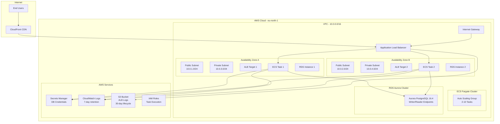

# Architecture Overview - Product Catalog API Infrastructure

## Executive Summary

This document provides a comprehensive architectural overview of the Product Catalog API infrastructure deployed using CDKTF with Python. The architecture implements a production-ready, scalable, and highly available system capable of handling seasonal traffic spikes while maintaining optimal performance and cost efficiency.

## Architecture Diagram

## Core Components

### 1. Content Delivery Network (CDN)
- **Service**: Amazon CloudFront
- **Purpose**: Global content delivery and edge caching
- **Configuration**:
  - Managed caching policy (CachingOptimized)
  - HTTP/HTTPS support
  - Global edge locations
  - Origin pointing to ALB

### 2. Load Balancing Layer
- **Service**: Application Load Balancer (ALB)
- **Configuration**:
  - Public-facing, internet-accessible
  - Health checks on `/health` endpoint
  - 30-second intervals, 2 failure threshold
  - HTTP listener on port 80
  - Logs stored in S3 with 30-day lifecycle

### 3. Container Orchestration
- **Service**: Amazon ECS Fargate
- **Cluster Configuration**:
  - FARGATE_SPOT capacity provider (cost optimization)
  - Auto-scaling: 2-10 tasks based on CPU (70% target)
  - 1 vCPU, 2GB memory per task
  - Port 3000 container mapping

### 4. Database Layer
- **Service**: Amazon RDS Aurora PostgreSQL
- **Configuration**:
  - Version 16.4 (eu-north-1 compatible)
  - Multi-AZ deployment across 2 availability zones
  - db.t3.medium instance class
  - Automatic backups enabled
  - Private subnet isolation

### 5. Security & Secrets Management
- **Service**: AWS Secrets Manager
- **Purpose**: Secure storage of database credentials
- **Configuration**:
  - Auto-generated passwords
  - Zero recovery window for test environments
  - Integration with ECS tasks

### 6. Observability Stack
- **CloudWatch Logs**: 7-day retention for ECS tasks
- **S3 Logging**: ALB access logs with 30-day lifecycle
- **Monitoring**: Built-in AWS service metrics

## Network Architecture

### VPC Design
- **CIDR**: 10.0.0.0/16 (65,536 IP addresses)
- **DNS Resolution**: Enabled
- **DNS Hostnames**: Enabled

### Subnet Strategy
| Subnet Type | AZ | CIDR | Purpose |
|-------------|----|----- |---------|
| Public | A | 10.0.1.0/24 | ALB, NAT Gateway |
| Public | B | 10.0.2.0/24 | ALB, NAT Gateway |
| Private | A | 10.0.3.0/24 | ECS Tasks, RDS |
| Private | B | 10.0.4.0/24 | ECS Tasks, RDS |

### Security Groups

#### ALB Security Group
- **Inbound**: Port 80 from 0.0.0.0/0 (Internet)
- **Outbound**: Port 3000 to ECS Security Group

#### ECS Security Group
- **Inbound**: Port 3000 from ALB Security Group
- **Outbound**: Port 5432 to RDS Security Group

#### RDS Security Group
- **Inbound**: Port 5432 from ECS Security Group
- **Outbound**: None (database doesn't initiate connections)

## Scalability & Performance

### Horizontal Scaling
- **ECS Auto Scaling**: CPU-based scaling (70% threshold)
- **Min Capacity**: 2 tasks (high availability)
- **Max Capacity**: 10 tasks (traffic spikes)
- **Scale-Out**: Add tasks when CPU > 70%
- **Scale-In**: Remove tasks when CPU < 70%

### Vertical Scaling Considerations
- **ECS Task Size**: Fixed at 1 vCPU, 2GB (optimized for API workload)
- **RDS Scaling**: Can be upgraded to larger instance classes
- **Storage**: Aurora auto-scales storage as needed

### Performance Optimization
- **CDN Caching**: Reduces origin load and improves global latency
- **Connection Pooling**: Managed by application layer
- **Regional Deployment**: eu-north-1 for European users
- **Spot Instances**: Cost optimization without sacrificing availability

## High Availability & Disaster Recovery

### Multi-AZ Deployment
- **ALB**: Spans multiple AZs automatically
- **ECS Tasks**: Distributed across AZs
- **RDS Aurora**: Writer in one AZ, reader in another
- **Subnets**: Redundant across 2 AZs

### Failover Mechanisms
- **ECS Health Checks**: Automatic task replacement on failure
- **ALB Health Checks**: Routes traffic only to healthy targets
- **Aurora Failover**: Automatic promotion of reader to writer (< 30 seconds)
- **Spot Instance Interruption**: Automatic task migration

### Data Protection
- **RDS Backups**: Automated daily backups
- **Point-in-Time Recovery**: Available for Aurora
- **No Deletion Protection**: Intentionally disabled for testing

## Security Architecture

### Defense in Depth
1. **Network Level**: VPC isolation, security groups
2. **Application Level**: Container isolation, least privilege IAM
3. **Data Level**: Encryption at rest and in transit
4. **Access Level**: Secrets Manager, no hardcoded credentials

### IAM Roles and Policies
- **ECS Task Execution Role**: ECR pull, CloudWatch logs
- **ECS Task Role**: Secrets Manager read access
- **Secrets Policy**: Limited to specific secret ARNs

### Encryption
- **ECS**: Container images encrypted in ECR
- **RDS**: Storage encryption enabled
- **S3**: Server-side encryption for logs
- **Secrets Manager**: Automatic encryption

## Cost Optimization Strategy

### Compute Costs
- **FARGATE_SPOT**: Up to 70% cost savings vs on-demand
- **Right-sizing**: 1 vCPU, 2GB optimized for API workload
- **Auto-scaling**: Scales down during low traffic periods

### Storage Costs
- **S3 Lifecycle**: 30-day deletion for access logs
- **CloudWatch**: 7-day retention (vs default indefinite)
- **Aurora**: Pay-per-use storage auto-scaling

### Network Costs
- **Single Region**: Avoid cross-region data transfer
- **CDN**: Reduces origin bandwidth usage
- **NAT Gateway**: Shared across AZs

## Deployment Patterns

### Blue-Green Deployment Support
- ECS service can maintain multiple task definitions
- ALB target groups support weighted routing
- Aurora readers can serve read-only traffic during deployments

### Rolling Updates
- ECS service automatically performs rolling updates
- Configurable deployment parameters (minimum healthy percent)
- Health checks prevent unhealthy task promotion

### Rollback Strategy
- ECS task definition versioning
- ALB target group health monitoring
- Aurora point-in-time recovery

## Monitoring & Observability

### Application Metrics
- **ECS Service Metrics**: CPU, memory utilization
- **ALB Metrics**: Request count, latency, error rates
- **Aurora Metrics**: Connections, query performance

### Infrastructure Metrics
- **Auto Scaling**: Scaling events and decisions
- **CloudFront**: Cache hit rates, origin latency
- **VPC Flow Logs**: Network traffic patterns (if enabled)

### Alerting Strategy
- CPU utilization > 80% (before scaling threshold)
- Database connection count approaching limits
- ALB 5xx error rate > threshold
- CloudFront origin error rates

## Compliance & Governance

### Tagging Strategy
- **Environment**: production (for resource categorization)
- **Project**: catalog-api (for cost allocation)
- **Environment Suffix**: Unique identifier per deployment

### Resource Naming Convention
- Format: `{resource-type}-{environment_suffix}`
- Examples: 
  - `alb-pr5706`
  - `ecs-cluster-pr5706`
  - `rds-cluster-pr5706`

### Infrastructure as Code
- **CDKTF with Python**: Version-controlled infrastructure
- **Terraform State**: Remote state in S3 with locking
- **Stack Outputs**: Key infrastructure endpoints

## Operational Procedures

### Deployment Checklist
1. ✅ Source environment variables (`source ./set-env.sh`)
2. ✅ Configure AWS credentials
3. ✅ Validate CDKTF synthesis (`npm run cdktf:synth`)
4. ✅ Review Terraform plan
5. ✅ Deploy infrastructure (`npm run cdktf:deploy`)
6. ✅ Verify health checks pass
7. ✅ Test application endpoints

### Troubleshooting Guide
- **ECS Tasks Not Starting**: Check IAM permissions, secrets access
- **ALB Health Checks Failing**: Verify security groups, application health
- **Database Connection Issues**: Check security groups, secrets configuration
- **CDN Cache Issues**: Review cache policies, origin behavior

### Maintenance Windows
- **RDS Maintenance**: Automatic during low-traffic periods
- **ECS Updates**: Rolling updates with zero downtime
- **Security Patches**: Automatic for managed services

## Future Enhancements

### Scalability Improvements
- **Application Auto Scaling**: Predictive scaling based on patterns
- **Database Scaling**: Aurora Serverless for variable workloads
- **Multi-Region**: Cross-region replication for global scale

### Security Enhancements
- **WAF Integration**: Web Application Firewall on CloudFront/ALB
- **VPC Flow Logs**: Network traffic monitoring
- **GuardDuty**: Threat detection and monitoring

### Operational Improvements
- **Container Insights**: Enhanced ECS monitoring
- **X-Ray Tracing**: Distributed request tracing
- **Config Rules**: Compliance monitoring and remediation

This architecture provides a solid foundation for the Product Catalog API with room for growth and enhancement as requirements evolve.