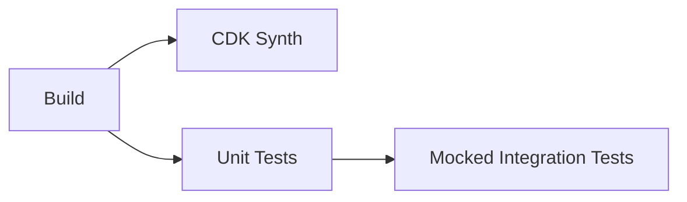
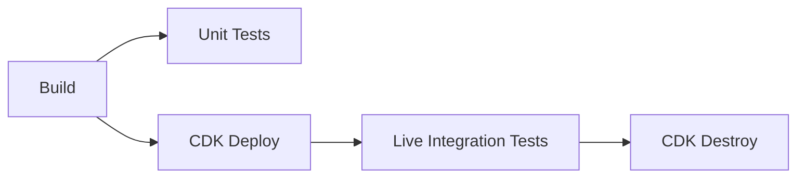

# CI/CD Pipeline Refactoring Summary

## 🎯 Objectives Achieved

✅ **DRY and Modular Design**: Created reusable composite actions for environment setup and AWS configuration  
✅ **Node.js 22 LTS Support**: Updated all Node.js references to version 22  
✅ **Production-Ready Pipeline**: Implemented build, test, CDK synth/deploy, and integration tests  
✅ **Robust Artifact Handling**: Proper artifact upload/download with build dependencies  
✅ **Security Best Practices**: Separated secrets from variables for proper data handling  

## 🏗️ Architecture

### Composite Actions
- **`.github/actions/setup-environment/`**: Handles Node.js setup, dependency installation, and artifact management
- **`.github/actions/configure-aws/`**: Manages AWS credential configuration

### Workflow Jobs
1. **Build**: Compiles TypeScript, uploads artifacts
2. **CDK Synth**: Validates CDK templates (PR only)
3. **Unit Tests**: Runs unit tests with coverage
4. **Integration Tests**: Mocked tests for PRs
5. **CDK Deploy**: Deploys to AWS (main branch only)
6. **Integration Tests (Live)**: Tests against live environment
7. **Cleanup**: Destroys AWS resources after testing

## 🔐 Secrets & Variables Management

### GitHub Secrets (Sensitive Data)
- `AWS_ACCESS_KEY_ID`
- `AWS_SECRET_ACCESS_KEY`

### GitHub Variables (Configuration)
- `AWS_REGION`
- `API_GATEWAY_ENDPOINT`
- `READ_ONLY_API_KEY`
- `ADMIN_API_KEY`

## 🚀 Pipeline Behavior

### Pull Requests


### Main Branch Push


## 📁 File Structure

```
.github/
├── workflows/
│   └── ci-cd.yml           # Main workflow
├── actions/
│   ├── setup-environment/  # Composite action for env setup
│   └── configure-aws/      # Composite action for AWS config
└── README.md              # Setup instructions
```

## 🔧 Key Features

- **Conditional Execution**: CDK synth only on PRs, deploy only on main
- **Environment Protection**: Production deployments use GitHub environments
- **Fallback Commands**: Uses `npx` fallback for missing binaries
- **Comprehensive Testing**: Unit tests + integration tests (mocked and live)
- **Artifact Management**: Proper build artifact handling between jobs
- **Error Handling**: Robust error handling and cleanup processes

## 📋 Next Steps

1. Set up GitHub secrets and variables as documented in `.github/README.md`
2. Test the pipeline with a pull request
3. Monitor the first main branch deployment
4. Adjust timeout values if needed for your specific use case
5. Consider adding additional environments (staging, etc.) if required

## 💡 Benefits

- **Reduced Duplication**: Composite actions eliminate repeated code
- **Enhanced Security**: Proper separation of secrets and configuration
- **Faster Feedback**: Parallel job execution where possible
- **Cost Optimization**: Cleanup job prevents AWS resource accumulation
- **Developer Experience**: Clear job names and comprehensive logging
