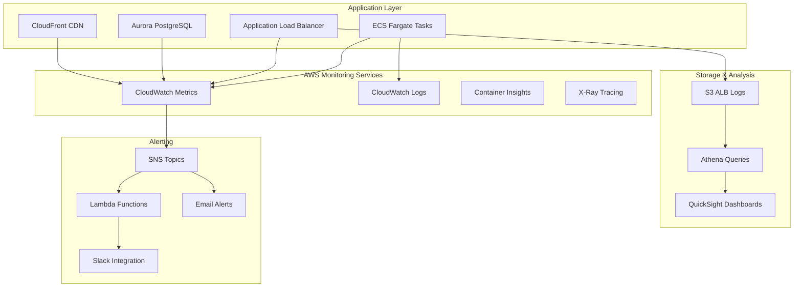

# Monitoring Guide - Product Catalog API Infrastructure

## Overview

This comprehensive monitoring guide covers observability, metrics, alerting, and operational procedures for the Product Catalog API infrastructure. The guide ensures proactive monitoring, rapid issue detection, and efficient troubleshooting.

## Monitoring Architecture

### Monitoring Stack Components



## Key Performance Indicators (KPIs)

### Application Performance KPIs

| Metric | Target | Warning | Critical | Description |
|--------|--------|---------|----------|-------------|
| Response Time (p95) | < 200ms | > 500ms | > 1000ms | API response latency |
| Throughput | > 100 RPS | < 50 RPS | < 10 RPS | Requests per second |
| Error Rate | < 1% | > 2% | > 5% | HTTP 4xx/5xx errors |
| Availability | > 99.9% | < 99.5% | < 99% | Service uptime |

### Infrastructure KPIs

| Metric | Target | Warning | Critical | Description |
|--------|--------|---------|----------|-------------|
| ECS CPU Utilization | 30-70% | > 80% | > 90% | Container CPU usage |
| ECS Memory Utilization | 30-70% | > 80% | > 90% | Container memory usage |
| RDS CPU Utilization | < 70% | > 80% | > 90% | Database CPU usage |
| RDS Connections | < 80% max | > 90% max | > 95% max | Database connections |
| ALB Target Health | 100% | < 90% | < 50% | Healthy targets |

### Business KPIs

| Metric | Target | Warning | Critical | Description |
|--------|--------|---------|----------|-------------|
| Cache Hit Ratio | > 80% | < 70% | < 50% | CloudFront cache efficiency |
| Geographic Latency | < 100ms | > 200ms | > 500ms | Regional performance |
| Cost per Request | < $0.001 | > $0.002 | > $0.005 | Cost efficiency |

## CloudWatch Metrics Configuration

### ECS Service Metrics

#### Built-in Metrics
```python
# ECS Service Metrics (automatically available)
ecs_service_metrics = [
    "CPUUtilization",
    "MemoryUtilization", 
    "TaskCount",
    "RunningTaskCount",
    "PendingTaskCount"
]

# Custom CloudWatch Dashboard
dashboard = Dashboard(
    self, "ecs-dashboard",
    dashboard_name=f"ECS-Catalog-API-{environment_suffix}"
)

# CPU Utilization Widget
dashboard.add_widgets(
    GraphWidget(
        title="ECS CPU Utilization",
        left=[
            Metric(
                namespace="AWS/ECS",
                metric_name="CPUUtilization",
                dimensions_map={
                    "ServiceName": f"catalog-api-service-{environment_suffix}",
                    "ClusterName": f"catalog-api-cluster-{environment_suffix}"
                },
                statistic="Average"
            )
        ],
        width=12,
        height=6
    )
)
```

#### Container Insights
```python
# Enable Container Insights for detailed metrics
cluster = Cluster(
    self, "ecs-cluster",
    cluster_name=f"catalog-api-cluster-{environment_suffix}",
    container_insights=True  # Enables Container Insights
)
```

**Additional Metrics from Container Insights:**
- Network metrics (NetworkRxBytes, NetworkTxBytes)
- Disk I/O metrics (StorageReadBytes, StorageWriteBytes) 
- Per-container resource utilization
- Task-level performance metrics

### Application Load Balancer Metrics

#### ALB Performance Monitoring
```python
# ALB Target Response Time
alb_response_time = Metric(
    namespace="AWS/ApplicationELB",
    metric_name="TargetResponseTime",
    dimensions_map={
        "LoadBalancer": alb.load_balancer_full_name
    },
    statistic="Average"
)

# ALB Request Count
alb_requests = Metric(
    namespace="AWS/ApplicationELB", 
    metric_name="RequestCount",
    dimensions_map={
        "LoadBalancer": alb.load_balancer_full_name
    },
    statistic="Sum"
)

# ALB Error Rates
alb_4xx_errors = Metric(
    namespace="AWS/ApplicationELB",
    metric_name="HTTPCode_Target_4XX_Count",
    dimensions_map={
        "LoadBalancer": alb.load_balancer_full_name
    },
    statistic="Sum"
)
```

#### ALB Access Log Analysis
```sql
-- Athena query for ALB access log analysis
CREATE TABLE alb_access_logs (
    type string,
    time string,
    elb string,
    client_ip string,
    client_port int,
    target_ip string,
    target_port int,
    request_processing_time double,
    target_processing_time double,
    response_processing_time double,
    elb_status_code string,
    target_status_code string,
    received_bytes bigint,
    sent_bytes bigint,
    request_verb string,
    request_url string,
    request_proto string,
    user_agent string,
    ssl_cipher string,
    ssl_protocol string,
    target_group_arn string,
    trace_id string,
    domain_name string,
    chosen_cert_arn string
)
PARTITIONED BY (year string, month string, day string)
STORED AS INPUTFORMAT 'org.apache.hadoop.mapred.TextInputFormat'
OUTPUTFORMAT 'org.apache.hadoop.hive.ql.io.HiveIgnoreKeyTextOutputFormat'
LOCATION 's3://your-bucket/alb-access-logs/';

-- Query for response time analysis
SELECT 
    DATE_TRUNC('hour', from_iso8601_timestamp(time)) as hour,
    AVG(target_processing_time) as avg_response_time,
    PERCENTILE_APPROX(target_processing_time, 0.95) as p95_response_time,
    PERCENTILE_APPROX(target_processing_time, 0.99) as p99_response_time,
    COUNT(*) as request_count
FROM alb_access_logs
WHERE year='2024' AND month='01' AND day='15'
GROUP BY DATE_TRUNC('hour', from_iso8601_timestamp(time))
ORDER BY hour;
```

### RDS Aurora Metrics

#### Database Performance
```python
# RDS CPU Utilization
rds_cpu = Metric(
    namespace="AWS/RDS",
    metric_name="CPUUtilization", 
    dimensions_map={
        "DBClusterIdentifier": f"rds-cluster-{environment_suffix}"
    },
    statistic="Average"
)

# Database Connections
rds_connections = Metric(
    namespace="AWS/RDS",
    metric_name="DatabaseConnections",
    dimensions_map={
        "DBClusterIdentifier": f"rds-cluster-{environment_suffix}"
    },
    statistic="Average"
)

# Query Performance
rds_read_latency = Metric(
    namespace="AWS/RDS",
    metric_name="ReadLatency",
    dimensions_map={
        "DBClusterIdentifier": f"rds-cluster-{environment_suffix}"
    },
    statistic="Average"
)
```

#### Performance Insights
```python
# Enable Performance Insights for detailed query analysis
rds_instance = DatabaseInstance(
    self, "rds-instance",
    engine=DatabaseInstanceEngine.postgres(
        version=PostgresEngineVersion.VER_16_4
    ),
    enable_performance_insights=True,
    performance_insights_retention=PerformanceInsightsRetention.DEFAULT
)
```

**Performance Insights Features:**
- Top SQL statements by execution time
- Wait event analysis
- Database load monitoring
- Historical performance trends

### CloudFront CDN Metrics

#### Edge Performance
```python
# CloudFront Cache Hit Rate
cf_cache_hit_rate = Metric(
    namespace="AWS/CloudFront",
    metric_name="CacheHitRate",
    dimensions_map={
        "DistributionId": cloudfront_distribution.distribution_id
    },
    statistic="Average"
)

# CloudFront Error Rate
cf_error_rate = Metric(
    namespace="AWS/CloudFront", 
    metric_name="ErrorRate",
    dimensions_map={
        "DistributionId": cloudfront_distribution.distribution_id
    },
    statistic="Average"
)

# Origin Latency
cf_origin_latency = Metric(
    namespace="AWS/CloudFront",
    metric_name="OriginLatency",
    dimensions_map={
        "DistributionId": cloudfront_distribution.distribution_id
    },
    statistic="Average"
)
```

## Logging Strategy

### CloudWatch Logs Configuration

#### ECS Application Logs
```python
# ECS Task Definition with comprehensive logging
log_group = LogGroup(
    self, "ecs-log-group",
    log_group_name=f"/aws/ecs/catalog-api-{environment_suffix}",
    retention=RetentionDays.ONE_WEEK,
    removal_policy=RemovalPolicy.DESTROY
)

container.add_log_driver(
    LogDrivers.aws_logs(
        group=log_group,
        stream_prefix="catalog-api",
        log_retention=RetentionDays.ONE_WEEK
    )
)
```

#### Structured Logging Format
```json
{
  "timestamp": "2024-01-15T10:30:00Z",
  "level": "INFO",
  "service": "catalog-api",
  "version": "1.2.3",
  "trace_id": "abc123def456",
  "user_id": "user123",
  "event": "product_search",
  "duration_ms": 45,
  "status_code": 200,
  "message": "Product search completed successfully",
  "metadata": {
    "search_term": "laptop",
    "results_count": 25,
    "filters_applied": ["category:electronics", "price:<1000"]
  }
}
```

### Log Analysis Queries

#### CloudWatch Logs Insights
```sql
-- Error Rate Analysis
fields @timestamp, level, message, status_code
| filter level = "ERROR" or status_code >= 400
| stats count() as error_count by bin(5m)
| sort @timestamp desc

-- Performance Analysis  
fields @timestamp, duration_ms, event
| filter event = "api_request"
| stats avg(duration_ms) as avg_response_time, 
        percentile(duration_ms, 95) as p95_response_time,
        percentile(duration_ms, 99) as p99_response_time
  by bin(5m)
| sort @timestamp desc

-- User Activity Analysis
fields @timestamp, user_id, event, message
| filter event like /search|view|purchase/
| stats count() as activity_count by user_id, event
| sort activity_count desc
| limit 100
```

## Alerting Configuration

### Critical Alerts (Immediate Response)

#### High Error Rate Alert
```python
high_error_rate_alarm = Alarm(
    self, "high-error-rate-alarm",
    metric=alb_4xx_errors,
    threshold=10,  # 10 errors in 5 minutes
    evaluation_periods=1,
    datapoints_to_alarm=1,
    alarm_description="High 4xx error rate detected",
    treat_missing_data=TreatMissingData.NOT_BREACHING
)

high_error_rate_alarm.add_alarm_action(
    SnsAction(
        Topic.from_topic_arn(
            self, "critical-alerts-topic",
            topic_arn=f"arn:aws:sns:eu-north-1:123456789012:critical-alerts"
        )
    )
)
```

#### Service Unavailable Alert
```python
service_down_alarm = Alarm(
    self, "service-down-alarm", 
    metric=Metric(
        namespace="AWS/ApplicationELB",
        metric_name="HealthyHostCount",
        dimensions_map={
            "TargetGroup": target_group.target_group_full_name
        },
        statistic="Average"
    ),
    threshold=1,  # Less than 1 healthy host
    comparison_operator=ComparisonOperator.LESS_THAN_THRESHOLD,
    evaluation_periods=2,
    alarm_description="All ECS tasks are unhealthy"
)
```

#### Database Connection Issues
```python
db_connection_alarm = Alarm(
    self, "db-connection-alarm",
    metric=rds_connections,
    threshold=80,  # 80% of max connections
    comparison_operator=ComparisonOperator.GREATER_THAN_THRESHOLD,
    evaluation_periods=2,
    alarm_description="RDS connection count approaching limit"
)
```

### Warning Alerts (Monitor Closely)

#### High CPU Usage
```python
high_cpu_alarm = Alarm(
    self, "high-cpu-alarm",
    metric=Metric(
        namespace="AWS/ECS",
        metric_name="CPUUtilization",
        dimensions_map={
            "ServiceName": f"catalog-api-service-{environment_suffix}",
            "ClusterName": f"catalog-api-cluster-{environment_suffix}"
        },
        statistic="Average"
    ),
    threshold=80,  # 80% CPU utilization
    evaluation_periods=3,
    alarm_description="ECS CPU utilization is high"
)
```

#### Response Time Degradation
```python
slow_response_alarm = Alarm(
    self, "slow-response-alarm",
    metric=alb_response_time,
    threshold=0.5,  # 500ms response time
    evaluation_periods=2,
    alarm_description="API response times are degraded"
)
```

### Notification Channels

#### SNS Topic Configuration
```python
# Critical alerts - immediate notification
critical_topic = Topic(
    self, "critical-alerts",
    display_name="Critical Infrastructure Alerts",
    topic_name=f"critical-alerts-{environment_suffix}"
)

# Subscribe email for critical alerts
critical_topic.add_subscription(
    EmailSubscription("devops-team@company.com")
)

# Subscribe SMS for critical alerts
critical_topic.add_subscription(
    SmsSubscription("+1234567890")
)

# Warning alerts - monitoring team
warning_topic = Topic(
    self, "warning-alerts",
    display_name="Warning Infrastructure Alerts",
    topic_name=f"warning-alerts-{environment_suffix}"
)

warning_topic.add_subscription(
    EmailSubscription("monitoring-team@company.com")
)
```

#### Slack Integration
```python
# Lambda function for Slack notifications
slack_lambda = Function(
    self, "slack-notifier",
    runtime=Runtime.PYTHON_3_9,
    handler="lambda_function.lambda_handler",
    code=Code.from_inline("""
import json
import urllib3

def lambda_handler(event, context):
    http = urllib3.PoolManager()
    
    # Parse SNS message
    message = json.loads(event['Records'][0]['Sns']['Message'])
    
    slack_payload = {
        'text': f"🚨 Alert: {message['AlarmName']}",
        'attachments': [
            {
                'color': 'danger' if message['NewStateValue'] == 'ALARM' else 'good',
                'fields': [
                    {
                        'title': 'Alarm Name',
                        'value': message['AlarmName'],
                        'short': True
                    },
                    {
                        'title': 'Status', 
                        'value': message['NewStateValue'],
                        'short': True
                    },
                    {
                        'title': 'Reason',
                        'value': message['NewStateReason'],
                        'short': False
                    }
                ]
            }
        ]
    }
    
    response = http.request(
        'POST',
        'https://hooks.slack.com/services/YOUR/SLACK/WEBHOOK',
        body=json.dumps(slack_payload),
        headers={'Content-Type': 'application/json'}
    )
    
    return {'statusCode': 200}
"""),
    environment={
        'SLACK_WEBHOOK_URL': 'https://hooks.slack.com/services/YOUR/SLACK/WEBHOOK'
    }
)

# Subscribe Lambda to SNS topics
critical_topic.add_subscription(LambdaSubscription(slack_lambda))
warning_topic.add_subscription(LambdaSubscription(slack_lambda))
```

## Dashboard Configuration

### Executive Dashboard
```python
exec_dashboard = Dashboard(
    self, "executive-dashboard",
    dashboard_name=f"Executive-View-{environment_suffix}"
)

# Key business metrics
exec_dashboard.add_widgets(
    SingleValueWidget(
        title="Service Availability",
        metrics=[
            Metric(
                namespace="AWS/ApplicationELB",
                metric_name="TargetResponseTime",
                dimensions_map={
                    "LoadBalancer": alb.load_balancer_full_name
                },
                statistic="Average"
            )
        ],
        width=6,
        height=6
    ),
    GraphWidget(
        title="Request Volume (24h)",
        left=[alb_requests],
        width=12,
        height=6
    )
)
```

### Operations Dashboard
```python
ops_dashboard = Dashboard(
    self, "operations-dashboard", 
    dashboard_name=f"Operations-{environment_suffix}"
)

# Infrastructure health metrics
ops_dashboard.add_widgets(
    GraphWidget(
        title="ECS Service Health",
        left=[
            Metric(
                namespace="AWS/ECS",
                metric_name="CPUUtilization",
                dimensions_map={
                    "ServiceName": f"catalog-api-service-{environment_suffix}",
                    "ClusterName": f"catalog-api-cluster-{environment_suffix}"
                }
            ),
            Metric(
                namespace="AWS/ECS", 
                metric_name="MemoryUtilization",
                dimensions_map={
                    "ServiceName": f"catalog-api-service-{environment_suffix}",
                    "ClusterName": f"catalog-api-cluster-{environment_suffix}"
                }
            )
        ],
        width=12,
        height=6
    ),
    LogQueryWidget(
        title="Recent Errors",
        log_group=log_group,
        query_lines=[
            "fields @timestamp, level, message",
            "filter level = 'ERROR'", 
            "sort @timestamp desc",
            "limit 20"
        ],
        width=12,
        height=6
    )
)
```

## Troubleshooting Playbooks

### High Response Time Investigation

#### Step 1: Identify the Bottleneck
```bash
# Check ALB metrics
aws cloudwatch get-metric-statistics \
  --namespace AWS/ApplicationELB \
  --metric-name TargetResponseTime \
  --dimensions Name=LoadBalancer,Value=${ALB_NAME} \
  --start-time $(date -u -d '1 hour ago' +%Y-%m-%dT%H:%M:%S) \
  --end-time $(date -u +%Y-%m-%dT%H:%M:%S) \
  --period 300 \
  --statistics Average,Maximum

# Check ECS CPU/Memory
aws cloudwatch get-metric-statistics \
  --namespace AWS/ECS \
  --metric-name CPUUtilization \
  --dimensions Name=ServiceName,Value=${ECS_SERVICE} Name=ClusterName,Value=${ECS_CLUSTER} \
  --start-time $(date -u -d '1 hour ago' +%Y-%m-%dT%H:%M:%S) \
  --end-time $(date -u +%Y-%m-%dT%H:%M:%S) \
  --period 300 \
  --statistics Average,Maximum
```

#### Step 2: Analyze Application Logs
```bash
# Check for application errors
aws logs filter-log-events \
  --log-group-name /aws/ecs/catalog-api-${ENVIRONMENT_SUFFIX} \
  --start-time $(date -d '1 hour ago' +%s)000 \
  --filter-pattern "ERROR" \
  --query 'events[*].[eventId,message]' \
  --output table
```

#### Step 3: Check Database Performance
```bash
# RDS CPU utilization
aws cloudwatch get-metric-statistics \
  --namespace AWS/RDS \
  --metric-name CPUUtilization \
  --dimensions Name=DBClusterIdentifier,Value=rds-cluster-${ENVIRONMENT_SUFFIX} \
  --start-time $(date -u -d '1 hour ago' +%Y-%m-%dT%H:%M:%S) \
  --end-time $(date -u +%Y-%m-%dT%H:%M:%S) \
  --period 300 \
  --statistics Average,Maximum

# Active database connections
aws cloudwatch get-metric-statistics \
  --namespace AWS/RDS \
  --metric-name DatabaseConnections \
  --dimensions Name=DBClusterIdentifier,Value=rds-cluster-${ENVIRONMENT_SUFFIX} \
  --start-time $(date -u -d '1 hour ago' +%Y-%m-%dT%H:%M:%S) \
  --end-time $(date -u +%Y-%m-%dT%H:%M:%S) \
  --period 300 \
  --statistics Average,Maximum
```

### Service Unavailability Investigation

#### Step 1: Check ECS Service Health
```bash
# ECS service status
aws ecs describe-services \
  --cluster catalog-api-cluster-${ENVIRONMENT_SUFFIX} \
  --services catalog-api-service-${ENVIRONMENT_SUFFIX} \
  --query 'services[0].{Status:status,Running:runningCount,Pending:pendingCount,Desired:desiredCount}'

# ECS task health
aws ecs list-tasks \
  --cluster catalog-api-cluster-${ENVIRONMENT_SUFFIX} \
  --service-name catalog-api-service-${ENVIRONMENT_SUFFIX} \
  --query 'taskArns[]' | xargs -I {} aws ecs describe-tasks --cluster catalog-api-cluster-${ENVIRONMENT_SUFFIX} --tasks {} --query 'tasks[0].{TaskArn:taskArn,LastStatus:lastStatus,HealthStatus:healthStatus}'
```

#### Step 2: Check ALB Target Health
```bash
# Target group health
aws elbv2 describe-target-health \
  --target-group-arn ${TARGET_GROUP_ARN} \
  --query 'TargetHealthDescriptions[*].{Target:Target.Id,Health:TargetHealth.State,Reason:TargetHealth.Reason}'
```

#### Step 3: Review Recent Deployments
```bash
# ECS deployment history
aws ecs describe-services \
  --cluster catalog-api-cluster-${ENVIRONMENT_SUFFIX} \
  --services catalog-api-service-${ENVIRONMENT_SUFFIX} \
  --query 'services[0].deployments[*].{Status:status,CreatedAt:createdAt,TaskDefinition:taskDefinition}'
```

## Performance Optimization

### Auto Scaling Configuration

#### ECS Service Auto Scaling
```python
# Auto scaling based on CPU utilization
scaling_target = scalable_target.ScalableTarget(
    self, "scaling-target",
    service_namespace=ApplicationAutoScalingServiceNamespace.ECS,
    resource_id=f"service/{cluster.cluster_name}/{service.service_name}",
    scalable_dimension="ecs:service:DesiredCount",
    min_capacity=2,
    max_capacity=10
)

scaling_policy = scalable_target.TargetTrackingScalingPolicy(
    self, "scaling-policy", 
    scaling_target=scaling_target,
    target_value=70,  # 70% CPU utilization
    metric=Metric(
        namespace="AWS/ECS",
        metric_name="CPUUtilization",
        dimensions_map={
            "ServiceName": service.service_name,
            "ClusterName": cluster.cluster_name
        }
    ),
    scale_out_cooldown=Duration.seconds(300),  # 5 minutes
    scale_in_cooldown=Duration.seconds(300)
)
```

#### Predictive Scaling (Advanced)
```python
# Custom metric for predictive scaling
custom_metric = Metric(
    namespace="CatalogAPI/Business",
    metric_name="PredictedLoad",
    dimensions_map={
        "Environment": environment_suffix
    }
)

# Lambda function to publish business metrics
business_metrics_lambda = Function(
    self, "business-metrics",
    runtime=Runtime.PYTHON_3_9,
    handler="lambda_function.lambda_handler",
    code=Code.from_inline("""
import boto3
import json
from datetime import datetime

def lambda_handler(event, context):
    cloudwatch = boto3.client('cloudwatch')
    
    # Example: Higher load expected during business hours
    hour = datetime.now().hour
    predicted_load = 100 if 9 <= hour <= 17 else 30
    
    cloudwatch.put_metric_data(
        Namespace='CatalogAPI/Business',
        MetricData=[
            {
                'MetricName': 'PredictedLoad',
                'Value': predicted_load,
                'Unit': 'Count',
                'Dimensions': [
                    {
                        'Name': 'Environment',
                        'Value': context.environment_suffix
                    }
                ]
            }
        ]
    )
    
    return {'statusCode': 200}
"""),
    environment={
        'ENVIRONMENT_SUFFIX': environment_suffix
    }
)

# Schedule business metrics collection
Rule(
    self, "business-metrics-schedule",
    schedule=Schedule.rate(Duration.minutes(15)),
    targets=[LambdaFunction(business_metrics_lambda)]
)
```

## Cost Monitoring

### Cost Allocation Tracking
```python
# Cost allocation tags
core.Tags.of(self).add("Project", "catalog-api")
core.Tags.of(self).add("Environment", "production") 
core.Tags.of(self).add("CostCenter", "engineering")
core.Tags.of(self).add("Owner", "platform-team")
```

### Cost Optimization Alerts
```python
# Budget alert for infrastructure costs
budget = Budget(
    self, "infrastructure-budget",
    budget_name=f"catalog-api-budget-{environment_suffix}",
    budget_limit=BudgetLimit.monthly_cost(500),  # $500 monthly limit
    cost_filters=BudgetCostFilter(
        tags={
            "Project": ["catalog-api"],
            "Environment": ["production"]
        }
    ),
    notifications=[
        BudgetNotification(
            type=NotificationType.ACTUAL,
            threshold=80,  # Alert at 80% of budget
            threshold_type=ThresholdType.PERCENTAGE,
            notification_type=NotificationTarget.EMAIL,
            address="finance-team@company.com"
        ),
        BudgetNotification(
            type=NotificationType.FORECASTED,
            threshold=100,  # Alert when forecasted to exceed budget
            threshold_type=ThresholdType.PERCENTAGE,
            notification_type=NotificationTarget.EMAIL,
            address="devops-team@company.com"
        )
    ]
)
```

## Maintenance and Operations

### Scheduled Maintenance Windows

#### RDS Maintenance
```python
# Schedule maintenance during low-traffic periods
rds_cluster.add_property_override(
    "PreferredMaintenanceWindow", "sun:03:00-sun:04:00"  # Sunday 3-4 AM UTC
)
rds_cluster.add_property_override(
    "PreferredBackupWindow", "02:00-03:00"  # Daily backup at 2 AM UTC
)
```

#### Container Updates
```bash
#!/bin/bash
# Automated container update script

# Get current task definition
CURRENT_TASK_DEF=$(aws ecs describe-services \
  --cluster catalog-api-cluster-${ENVIRONMENT_SUFFIX} \
  --services catalog-api-service-${ENVIRONMENT_SUFFIX} \
  --query 'services[0].taskDefinition' --output text)

# Update container image
NEW_TASK_DEF=$(aws ecs describe-task-definition \
  --task-definition $CURRENT_TASK_DEF \
  --query 'taskDefinition' \
  --output json | jq '.containerDefinitions[0].image = "new-image:latest"' | jq 'del(.taskDefinitionArn, .revision, .status, .requiresAttributes, .placementConstraints, .compatibilities, .registeredAt, .registeredBy)')

# Register new task definition
aws ecs register-task-definition --cli-input-json "$NEW_TASK_DEF"

# Update service with new task definition
aws ecs update-service \
  --cluster catalog-api-cluster-${ENVIRONMENT_SUFFIX} \
  --service catalog-api-service-${ENVIRONMENT_SUFFIX} \
  --task-definition catalog-api:LATEST
```

This comprehensive monitoring guide ensures complete observability and proactive management of the Product Catalog API infrastructure, enabling rapid issue detection and resolution while maintaining optimal performance and cost efficiency.