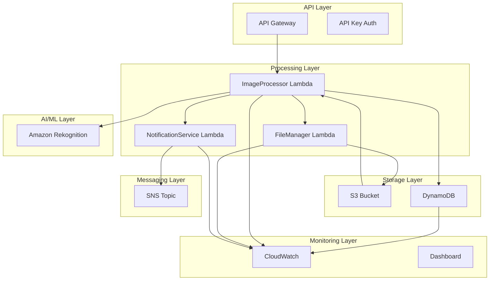

# AWS CDK Serverless Image Detector Infrastructure

I'll create a production-ready serverless image classification system using AWS CDK with TypeScript. This implementation will demonstrate enterprise-grade architecture with comprehensive security, monitoring, and scalability.

## 🏗️ Architecture Overview



## 📁 Project Structure

```
serverless-image-detector/
├── lib/
│   ├── constructs/
│   │   ├── api-gateway-construct.ts
│   │   ├── lambda-construct.ts
│   │   ├── storage-construct.ts
│   │   ├── monitoring-construct.ts
│   │   └── security-construct.ts
│   ├── lambda/
│   │   ├── image-processor/
│   │   ├── file-manager/
│   │   └── notification-service/
│   └── serverless-app-stack.ts
├── bin/
│   └── serverless-app.ts
├── test/
├── package.json
├── tsconfig.json
└── README.md
```

## 🚀 Implementation

### 1. Main CDK App Entry Point

**`bin/serverless-app.ts`**

```typescript
#!/usr/bin/env node
import 'source-map-support/register';
import * as cdk from 'aws-cdk-lib';
import { ServerlessAppStack } from '../lib/serverless-app-stack';

const app = new cdk.App();

// Environment configuration
const env = {
  account: process.env.CDK_DEFAULT_ACCOUNT,
  region: 'us-east-1',
};

// Deploy stack with environment-specific configuration
new ServerlessAppStack(app, 'ServerlessAppStack', {
  env,
  stackName: 'serverlessapp-image-detector',
  description: 'Production-ready serverless image classification system',
  tags: {
    Environment: app.node.tryGetContext('environment') || 'dev',
    Project: 'ServerlessImageDetector',
    Owner: 'DevOps Team',
    CostCenter: 'Engineering',
  },
});
```

### 2. Main Stack Implementation

**`lib/serverless-app-stack.ts`**

```typescript
import * as cdk from 'aws-cdk-lib';
import { Construct } from 'constructs';
import { StorageConstruct } from './constructs/storage-construct';
import { LambdaConstruct } from './constructs/lambda-construct';
import { ApiGatewayConstruct } from './constructs/api-gateway-construct';
import { MonitoringConstruct } from './constructs/monitoring-construct';
import { SecurityConstruct } from './constructs/security-construct';

export class ServerlessAppStack extends cdk.Stack {
  constructor(scope: Construct, id: string, props?: cdk.StackProps) {
    super(scope, id, props);

    const environment = this.node.tryGetContext('environment') || 'dev';

    // Security layer - IAM roles and policies
    const security = new SecurityConstruct(this, 'Security', {
      environment,
    });

    // Storage layer - S3 and DynamoDB
    const storage = new StorageConstruct(this, 'Storage', {
      environment,
    });

    // Lambda functions layer
    const lambdaFunctions = new LambdaConstruct(this, 'Lambda', {
      environment,
      bucket: storage.imageBucket,
      table: storage.detectionTable,
      rekognitionRole: security.rekognitionRole,
      lambdaRole: security.lambdaRole,
      snsRole: security.snsRole,
    });

    // API Gateway layer
    const api = new ApiGatewayConstruct(this, 'ApiGateway', {
      environment,
      imageProcessorFunction: lambdaFunctions.imageProcessorFunction,
      bucket: storage.imageBucket,
    });

    // Monitoring and observability layer
    const monitoring = new MonitoringConstruct(this, 'Monitoring', {
      environment,
      lambdaFunctions: [
        lambdaFunctions.imageProcessorFunction,
        lambdaFunctions.fileManagerFunction,
        lambdaFunctions.notificationFunction,
      ],
      api: api.restApi,
      table: storage.detectionTable,
      bucket: storage.imageBucket,
    });

    // Stack outputs
    new cdk.CfnOutput(this, 'ApiEndpoint', {
      value: api.restApi.url,
      description: 'API Gateway endpoint URL',
    });

    new cdk.CfnOutput(this, 'BucketName', {
      value: storage.imageBucket.bucketName,
      description: 'S3 bucket for image storage',
    });

    new cdk.CfnOutput(this, 'TableName', {
      value: storage.detectionTable.tableName,
      description: 'DynamoDB table for detection logs',
    });

    new cdk.CfnOutput(this, 'DashboardUrl', {
      value: `https://${this.region}.console.aws.amazon.com/cloudwatch/home?region=${this.region}#dashboards:name=${monitoring.dashboard.dashboardName}`,
      description: 'CloudWatch Dashboard URL',
    });
  }
}
```

### 3. Storage Construct

**`lib/constructs/storage-construct.ts`**

```typescript
import * as cdk from 'aws-cdk-lib';
import * as s3 from 'aws-cdk-lib/aws-s3';
import * as dynamodb from 'aws-cdk-lib/aws-dynamodb';
import * as sns from 'aws-cdk-lib/aws-sns';
import { Construct } from 'constructs';

interface StorageConstructProps {
  environment: string;
}

export class StorageConstruct extends Construct {
  public readonly imageBucket: s3.Bucket;
  public readonly detectionTable: dynamodb.Table;
  public readonly notificationTopic: sns.Topic;

  constructor(scope: Construct, id: string, props: StorageConstructProps) {
    super(scope, id);

    // S3 Bucket for image storage
    this.imageBucket = new s3.Bucket(this, 'ImageBucket', {
      bucketName: `serverlessapp-pet-detector-${props.environment}-${cdk.Aws.ACCOUNT_ID}`,
      encryption: s3.BucketEncryption.S3_MANAGED,
      blockPublicAccess: s3.BlockPublicAccess.BLOCK_ALL,
      versioned: true,
      lifecycleRules: [
        {
          id: 'DeleteIncompleteMultipartUploads',
          abortIncompleteMultipartUploadAfter: cdk.Duration.days(1),
        },
        {
          id: 'TransitionToIA',
          transitions: [
            {
              storageClass: s3.StorageClass.INFREQUENT_ACCESS,
              transitionAfter: cdk.Duration.days(30),
            },
            {
              storageClass: s3.StorageClass.GLACIER,
              transitionAfter: cdk.Duration.days(90),
            },
          ],
        },
      ],
      removalPolicy:
        props.environment === 'prod'
          ? cdk.RemovalPolicy.RETAIN
          : cdk.RemovalPolicy.DESTROY,
      autoDeleteObjects: props.environment !== 'prod',
    });

    // Create folder structure with placeholder objects
    new s3.BucketDeployment(this, 'BucketStructure', {
      sources: [
        s3.Source.data('input/.keep', ''),
        s3.Source.data('cats/.keep', ''),
        s3.Source.data('dogs/.keep', ''),
        s3.Source.data('others/.keep', ''),
      ],
      destinationBucket: this.imageBucket,
    });

    // DynamoDB table for detection logs
    this.detectionTable = new dynamodb.Table(this, 'DetectionTable', {
      tableName: `serverlessapp-detection-logs-${props.environment}`,
      partitionKey: {
        name: 'ImageID',
        type: dynamodb.AttributeType.STRING,
      },
      sortKey: {
        name: 'Timestamp',
        type: dynamodb.AttributeType.STRING,
      },
      billingMode: dynamodb.BillingMode.PAY_PER_REQUEST,
      encryption: dynamodb.TableEncryption.AWS_MANAGED,
      pointInTimeRecovery: props.environment === 'prod',
      stream: dynamodb.StreamViewType.NEW_AND_OLD_IMAGES,
      timeToLiveAttribute: 'TTL',
      removalPolicy:
        props.environment === 'prod'
          ? cdk.RemovalPolicy.RETAIN
          : cdk.RemovalPolicy.DESTROY,
    });

    // Global Secondary Index for querying by detection status
    this.detectionTable.addGlobalSecondaryIndex({
      indexName: 'ProcessingStatusIndex',
      partitionKey: {
        name: 'ProcessingStatus',
        type: dynamodb.AttributeType.STRING,
      },
      sortKey: {
        name: 'Timestamp',
        type: dynamodb.AttributeType.STRING,
      },
    });

    // SNS Topic for notifications
    this.notificationTopic = new sns.Topic(this, 'NotificationTopic', {
      topicName: `serverlessapp-notifications-${props.environment}`,
      displayName: 'Image Detection Notifications',
      fifo: false,
    });

    // Add tags to all resources
    cdk.Tags.of(this).add('Component', 'Storage');
    cdk.Tags.of(this).add('Environment', props.environment);
  }
}
```

### 4. Security Construct

**`lib/constructs/security-construct.ts`**

```typescript
import * as cdk from 'aws-cdk-lib';
import * as iam from 'aws-cdk-lib/aws-iam';
import { Construct } from 'constructs';

interface SecurityConstructProps {
  environment: string;
}

export class SecurityConstruct extends Construct {
  public readonly lambdaRole: iam.Role;
  public readonly rekognitionRole: iam.Role;
  public readonly snsRole: iam.Role;

  constructor(scope: Construct, id: string, props: SecurityConstructProps) {
    super(scope, id);

    // Lambda execution role with least privilege
    this.lambdaRole = new iam.Role(this, 'LambdaExecutionRole', {
      roleName: `serverlessapp-lambda-role-${props.environment}`,
      assumedBy: new iam.ServicePrincipal('lambda.amazonaws.com'),
      managedPolicies: [
        iam.ManagedPolicy.fromAwsManagedPolicyName(
          'service-role/AWSLambdaBasicExecutionRole'
        ),
      ],
      inlinePolicies: {
        DynamoDBAccess: new iam.PolicyDocument({
          statements: [
            new iam.PolicyStatement({
              effect: iam.Effect.ALLOW,
              actions: [
                'dynamodb:PutItem',
                'dynamodb:GetItem',
                'dynamodb:UpdateItem',
                'dynamodb:Query',
                'dynamodb:Scan',
              ],
              resources: [
                `arn:aws:dynamodb:${cdk.Aws.REGION}:${cdk.Aws.ACCOUNT_ID}:table/serverlessapp-detection-logs-${props.environment}`,
                `arn:aws:dynamodb:${cdk.Aws.REGION}:${cdk.Aws.ACCOUNT_ID}:table/serverlessapp-detection-logs-${props.environment}/index/*`,
              ],
            }),
          ],
        }),
        S3Access: new iam.PolicyDocument({
          statements: [
            new iam.PolicyStatement({
              effect: iam.Effect.ALLOW,
              actions: [
                's3:GetObject',
                's3:PutObject',
                's3:DeleteObject',
                's3:GetObjectVersion',
              ],
              resources: [
                `arn:aws:s3:::serverlessapp-pet-detector-${props.environment}-${cdk.Aws.ACCOUNT_ID}/*`,
              ],
            }),
            new iam.PolicyStatement({
              effect: iam.Effect.ALLOW,
              actions: ['s3:ListBucket', 's3:GetBucketLocation'],
              resources: [
                `arn:aws:s3:::serverlessapp-pet-detector-${props.environment}-${cdk.Aws.ACCOUNT_ID}`,
              ],
            }),
          ],
        }),
        LambdaInvoke: new iam.PolicyDocument({
          statements: [
            new iam.PolicyStatement({
              effect: iam.Effect.ALLOW,
              actions: ['lambda:InvokeFunction'],
              resources: [
                `arn:aws:lambda:${cdk.Aws.REGION}:${cdk.Aws.ACCOUNT_ID}:function:serverlessapp-*`,
              ],
            }),
          ],
        }),
      },
    });

    // Rekognition service role
    this.rekognitionRole = new iam.Role(this, 'RekognitionRole', {
      roleName: `serverlessapp-rekognition-role-${props.environment}`,
      assumedBy: new iam.ServicePrincipal('lambda.amazonaws.com'),
      inlinePolicies: {
        RekognitionAccess: new iam.PolicyDocument({
          statements: [
            new iam.PolicyStatement({
              effect: iam.Effect.ALLOW,
              actions: [
                'rekognition:DetectLabels',
                'rekognition:DetectModerationLabels',
              ],
              resources: ['*'],
            }),
          ],
        }),
      },
    });

    // SNS publishing role
    this.snsRole = new iam.Role(this, 'SNSRole', {
      roleName: `serverlessapp-sns-role-${props.environment}`,
      assumedBy: new iam.ServicePrincipal('lambda.amazonaws.com'),
      inlinePolicies: {
        SNSPublish: new iam.PolicyDocument({
          statements: [
            new iam.PolicyStatement({
              effect: iam.Effect.ALLOW,
              actions: ['sns:Publish'],
              resources: [
                `arn:aws:sns:${cdk.Aws.REGION}:${cdk.Aws.ACCOUNT_ID}:serverlessapp-notifications-${props.environment}`,
              ],
            }),
          ],
        }),
      },
    });

    // Add tags
    cdk.Tags.of(this).add('Component', 'Security');
    cdk.Tags.of(this).add('Environment', props.environment);
  }
}
```

### 5. Lambda Construct

**`lib/constructs/lambda-construct.ts`**

```typescript
import * as cdk from 'aws-cdk-lib';
import * as lambda from 'aws-cdk-lib/aws-lambda';
import * as nodejs from 'aws-cdk-lib/aws-lambda-nodejs';
import * as s3 from 'aws-cdk-lib/aws-s3';
import * as dynamodb from 'aws-cdk-lib/aws-dynamodb';
import * as iam from 'aws-cdk-lib/aws-iam';
import * as sns from 'aws-cdk-lib/aws-sns';
import { Construct } from 'constructs';

interface LambdaConstructProps {
  environment: string;
  bucket: s3.Bucket;
  table: dynamodb.Table;
  rekognitionRole: iam.Role;
  lambdaRole: iam.Role;
  snsRole: iam.Role;
}

export class LambdaConstruct extends Construct {
  public readonly imageProcessorFunction: lambda.Function;
  public readonly fileManagerFunction: lambda.Function;
  public readonly notificationFunction: lambda.Function;

  constructor(scope: Construct, id: string, props: LambdaConstructProps) {
    super(scope, id);

    // Common Lambda configuration
    const commonProps = {
      runtime: lambda.Runtime.NODEJS_18_X,
      timeout: cdk.Duration.minutes(5),
      memorySize: 512,
      environment: {
        ENVIRONMENT: props.environment,
        BUCKET_NAME: props.bucket.bucketName,
        TABLE_NAME: props.table.tableName,
        REGION: cdk.Aws.REGION,
      },
      bundling: {
        minify: true,
        sourceMap: true,
        target: 'es2020',
      },
    };

    // Image Processor Lambda
    this.imageProcessorFunction = new nodejs.NodejsFunction(
      this,
      'ImageProcessor',
      {
        ...commonProps,
        functionName: `serverlessapp-image-processor-${props.environment}`,
        entry: 'lib/lambda/image-processor/index.ts',
        role: props.lambdaRole,
        environment: {
          ...commonProps.environment,
          FILE_MANAGER_FUNCTION: `serverlessapp-file-manager-${props.environment}`,
          NOTIFICATION_FUNCTION: `serverlessapp-notification-service-${props.environment}`,
        },
      }
    );

    // File Manager Lambda
    this.fileManagerFunction = new nodejs.NodejsFunction(this, 'FileManager', {
      ...commonProps,
      functionName: `serverlessapp-file-manager-${props.environment}`,
      entry: 'lib/lambda/file-manager/index.ts',
      role: props.lambdaRole,
      memorySize: 256,
      timeout: cdk.Duration.minutes(2),
    });

    // Notification Service Lambda
    this.notificationFunction = new nodejs.NodejsFunction(
      this,
      'NotificationService',
      {
        ...commonProps,
        functionName: `serverlessapp-notification-service-${props.environment}`,
        entry: 'lib/lambda/notification-service/index.ts',
        role: props.snsRole,
        memorySize: 256,
        timeout: cdk.Duration.minutes(1),
        environment: {
          ...commonProps.environment,
          SNS_TOPIC_ARN: `arn:aws:sns:${cdk.Aws.REGION}:${cdk.Aws.ACCOUNT_ID}:serverlessapp-notifications-${props.environment}`,
        },
      }
    );

    // Grant permissions
    props.bucket.grantReadWrite(this.imageProcessorFunction);
    props.bucket.grantReadWrite(this.fileManagerFunction);
    props.table.grantReadWriteData(this.imageProcessorFunction);

    // Grant Rekognition permissions to image processor
    this.imageProcessorFunction.addToRolePolicy(
      new iam.PolicyStatement({
        effect: iam.Effect.ALLOW,
        actions: ['rekognition:DetectLabels'],
        resources: ['*'],
      })
    );

    // Add tags
    cdk.Tags.of(this).add('Component', 'Compute');
    cdk.Tags.of(this).add('Environment', props.environment);
  }
}
```

### 6. API Gateway Construct

**`lib/constructs/api-gateway-construct.ts`**

```typescript
import * as cdk from 'aws-cdk-lib';
import * as apigateway from 'aws-cdk-lib/aws-apigateway';
import * as lambda from 'aws-cdk-lib/aws-lambda';
import * as s3 from 'aws-cdk-lib/aws-s3';
import { Construct } from 'constructs';

interface ApiGatewayConstructProps {
  environment: string;
  imageProcessorFunction: lambda.Function;
  bucket: s3.Bucket;
}

export class ApiGatewayConstruct extends Construct {
  public readonly restApi: apigateway.RestApi;

  constructor(scope: Construct, id: string, props: ApiGatewayConstructProps) {
    super(scope, id);

    // Create API Gateway
    this.restApi = new apigateway.RestApi(this, 'ImageDetectorApi', {
      restApiName: `serverlessapp-image-detector-api-${props.environment}`,
      description: 'API for serverless image detection system',
      deployOptions: {
        stageName: props.environment,
        throttle: {
          rateLimit: 100,
          burstLimit: 200,
        },
        loggingLevel: apigateway.MethodLoggingLevel.INFO,
        dataTraceEnabled: true,
        metricsEnabled: true,
      },
      defaultCorsPreflightOptions: {
        allowOrigins: apigateway.Cors.ALL_ORIGINS,
        allowMethods: apigateway.Cors.ALL_METHODS,
        allowHeaders: [
          'Content-Type',
          'X-Amz-Date',
          'Authorization',
          'X-Api-Key',
        ],
      },
    });

    // API Key and Usage Plan
    const apiKey = this.restApi.addApiKey('ApiKey', {
      apiKeyName: `serverlessapp-api-key-${props.environment}`,
      description: 'API key for image detector service',
    });

    const usagePlan = this.restApi.addUsagePlan('UsagePlan', {
      name: `serverlessapp-usage-plan-${props.environment}`,
      description: 'Usage plan for image detector API',
      throttle: {
        rateLimit: 100,
        burstLimit: 200,
      },
      quota: {
        limit: 10000,
        period: apigateway.Period.MONTH,
      },
    });

    usagePlan.addApiKey(apiKey);
    usagePlan.addApiStage({
      stage: this.restApi.deploymentStage,
    });

    // Lambda integration
    const lambdaIntegration = new apigateway.LambdaIntegration(
      props.imageProcessorFunction,
      {
        requestTemplates: {
          'application/json': '{ "statusCode": "200" }',
        },
      }
    );

    // Request validator
    const requestValidator = new apigateway.RequestValidator(
      this,
      'RequestValidator',
      {
        restApi: this.restApi,
        requestValidatorName: 'request-validator',
        validateRequestBody: true,
        validateRequestParameters: true,
      }
    );

    // Image upload model
    const imageUploadModel = new apigateway.Model(this, 'ImageUploadModel', {
      restApi: this.restApi,
      modelName: 'ImageUploadModel',
      contentType: 'application/json',
      schema: {
        type: apigateway.JsonSchemaType.OBJECT,
        properties: {
          imageData: {
            type: apigateway.JsonSchemaType.STRING,
            description: 'Base64 encoded image data',
          },
          fileName: {
            type: apigateway.JsonSchemaType.STRING,
            description: 'Original filename',
          },
          contentType: {
            type: apigateway.JsonSchemaType.STRING,
            description: 'Image MIME type',
          },
        },
        required: ['imageData', 'fileName', 'contentType'],
      },
    });

    // API Resources and Methods
    const imagesResource = this.restApi.root.addResource('images');

    // POST /images - Upload image for processing
    imagesResource.addMethod('POST', lambdaIntegration, {
      apiKeyRequired: true,
      requestValidator,
      requestModels: {
        'application/json': imageUploadModel,
      },
      methodResponses: [
        {
          statusCode: '200',
          responseModels: {
            'application/json': apigateway.Model.GENERIC_MODEL,
          },
        },
        {
          statusCode: '400',
          responseModels: {
            'application/json': apigateway.Model.ERROR_MODEL,
          },
        },
        {
          statusCode: '500',
          responseModels: {
            'application/json': apigateway.Model.ERROR_MODEL,
          },
        },
      ],
    });

    // GET /images - List processed images
    imagesResource.addMethod('GET', lambdaIntegration, {
      apiKeyRequired: true,
      requestParameters: {
        'method.request.querystring.status': false,
        'method.request.querystring.limit': false,
      },
    });

    // GET /images/{id} - Get specific image details
    const imageResource = imagesResource.addResource('{id}');
    imageResource.addMethod('GET', lambdaIntegration, {
      apiKeyRequired: true,
      requestParameters: {
        'method.request.path.id': true,
      },
    });

    // Add tags
    cdk.Tags.of(this).add('Component', 'API');
    cdk.Tags.of(this).add('Environment', props.environment);
  }
}
```

### 7. Lambda Function Implementations

**`lib/lambda/image-processor/index.ts`**

```typescript
import { APIGatewayProxyEvent, APIGatewayProxyResult } from 'aws-lambda';
import { DynamoDBClient, PutItemCommand, GetItemCommand, QueryCommand } from '@aws-sdk/client-dynamodb';
import { S3Client, PutObjectCommand, GetObjectCommand } from '@aws-sdk/client-s3';
import { RekognitionClient, DetectLabelsCommand } from '@aws-sdk/client-rekognition';
import { LambdaClient, InvokeCommand } from '@aws-sdk/client-lambda';
import { v4 as uuidv4 } from 'uuid';

const dynamoClient = new DynamoDBClient({ region: process.env.REGION });
const s3Client = new S3Client({ region: process.env.REGION });
const rekognitionClient = new RekognitionClient({ region: process.env.REGION });
const lambdaClient = new LambdaClient({ region: process.env.REGION });

interface ImageProcessingRequest {
  imageData: string;
  fileName: string;
  contentType: string;
}

interface DetectionResult {
  imageId: string;
  detectedAnimal: string;
  confidenceScore: number;
  timestamp: string;
  s3Location: string;
  processingStatus: string;
  fileSize: number;
  imageFormat: string;
}

export const handler = async (event: APIGatewayProxyEvent): Promise<APIGatewayProxyResult> => {
  console.log('Event:', JSON.stringify(event, null, 2));

  try {
    const httpMethod = event.httpMethod;
    const path = event.path;

    switch (httpMethod) {
      case 'POST':
        return await handleImageUpload(event);
      case 'GET':
        if (event.pathParameters?.id) {
          return await handleGetImage(event.pathParameters.id);
        } else {
          return await handleListImages(event);
        }
      default:
        return {
          statusCode: 405,
          headers: {
            'Content-Type': 'application/json',
            'Access-Control-Allow-Origin': '*'
          },
          body: JSON.stringify({ error: 'Method not allowed' })
        };
    }
  } catch (error) {
    console.error('Error processing request:', error);
    return {
      statusCode: 500,
      headers: {
        'Content-Type': 'application/json',
        'Access-Control-Allow-Origin': '*'
      },
      body: JSON.stringify({
        error: 'Internal server error',
        message: error instanceof Error ? error.message : 'Unknown error'
      })
    };
  }
};

async function handleImageUpload(event: APIGatewayProxyEvent): Promise<APIGatewayProxyResult> {
  if (!event.body) {
    return {
      statusCode: 400,
      headers: { 'Content-Type': 'application/json', 'Access-Control-Allow-Origin': '*' },
      body: JSON.stringify({ error: 'Request body is required' })
    };
  }

  const request: ImageProcessingRequest = JSON.parse(event.body);
  const imageId = uuidv4();
  const timestamp = new Date().toISOString();

  // Validate input
  if (!request.imageData || !request.fileName || !request.contentType) {
    return {
      statusCode: 400,
      headers: { 'Content-Type': 'application/json', 'Access-Control-Allow-Origin': '*' },
      body: JSON.stringify({ error: 'Missing required fields: imageData, fileName, contentType' })
    };
  }

  try {
    // Decode base64 image
    const imageBuffer = Buffer.from(request.imageData, 'base64');
    const fileExtension = request.fileName.split('.').pop()?.toLowerCase() || 'jpg';
    const s3Key = `input/${imageId}.${fileExtension}`;

    // Upload to S3
    await s3Client.send(new PutObjectCommand({
      Bucket: process.env.BUCKET_NAME,
      Key: s3Key,
      Body: imageBuffer,
      ContentType: request.contentType,
      Metadata: {
        originalFileName: request.fileName,
        uploadTimestamp: timestamp
      }
    }));

    // Analyze image with Rekognition
    const rekognitionResponse = await rekognitionClient.send(new DetectLabelsCommand({
      Image: {
        Bytes: imageBuffer
      },
      MaxLabels: 10,
      MinConfidence: 70
    }));

    // Process detection results
    const detectionResult = processDetectionResults(rekognitionResponse.Labels || []);

    // Create detection record
    const detectionRecord: DetectionResult = {
      imageId,
      detectedAnimal: detectionResult.animal,
      confidenceScore: detectionResult.confidence,
      timestamp,
      s3Location: `s3://${process.env.BUCKET_NAME}/${s3Key}`,
      processingStatus: 'completed',
      fileSize: imageBuffer.length,
      imageFormat: fileExtension
    };

    // Save to DynamoDB
    await dynamoClient.send(new PutItemCommand({
      TableName: process.env.TABLE_NAME,
      Item: {
        ImageID: { S: imageId },
        Timestamp: { S: timestamp },
        DetectedAnimal: { S: detectionResult.animal },
        ConfidenceScore: { N: detectionResult.confidence.toString() },
        S3Location: { S: detectionRecord.s3Location },
        ProcessingStatus: { S: 'completed' },
        FileSize: { N: imageBuffer.length.toString() },
        ImageFormat: { S: fileExtension },
        TTL: { N: Math.floor((Date.now() + (90 * 24 * 60 * 60 * 1000)) / 1000).toString() }
      }
    }));

    // Invoke file manager to organize the file
    await lambdaClient.send(new InvokeCommand({
      FunctionName: process.env.FILE_MANAGER_FUNCTION,
      InvocationType: '
```
