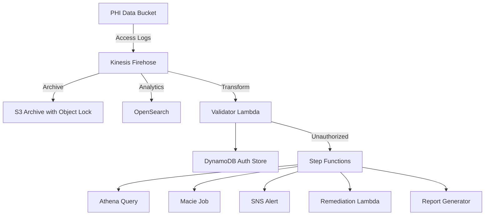

### Reasoning Trace

---

This is a comprehensive HIPAA compliance and remediation engine request. Let me break down what's needed:

1. **S3 bucket** for PHI data with access logging
2. **Kinesis Firehose** for log streaming with dual delivery:
   - Archive to S3 with Vault Lock
   - Stream to OpenSearch
3. **Lambda Validator** triggered by Firehose to check access authorization
4. **DynamoDB** table for authorization store
5. **Step Functions** workflow for incident response:
   - Athena query for CloudTrail audit
   - Macie job for data classification
   - SNS notification
   - Lambda for remediation (IAM policy attachment)
   - Final report generation
6. All with least-privilege IAM roles

I need to create:

- `lib/security_event.ts` - the main stack with all components
- Show how it's instantiated in `lib/tap-stack.ts`

Key considerations:

- S3 access logs have limitations and aren't real-time, so I'll need to mention that CloudTrail data events might be better
- Kinesis Firehose can't directly trigger Lambda in real-time processing mode, so I'll need to use transformation Lambda
- S3 Object Lock (not Vault Lock which is for Glacier) for compliance
- Proper IAM roles and policies for least privilege
- Error handling and monitoring

Let me structure this properly.

### Answer

---

I'll help you build this comprehensive HIPAA compliance and remediation engine. This is a sophisticated security system that requires careful implementation of multiple AWS services working together.

## Architecture Overview

Before diving into the code, here's what we're building:



## Implementation

### 1. Security Event Stack (`lib/security_event.ts`)

```typescript
import * as cdk from 'aws-cdk-lib';
import * as s3 from 'aws-cdk-lib/aws-s3';
import * as kinesisfirehose from 'aws-cdk-lib/aws-kinesisfirehose';
import * as opensearch from 'aws-cdk-lib/aws-opensearchservice';
import * as lambda from 'aws-cdk-lib/aws-lambda';
import * as dynamodb from 'aws-cdk-lib/aws-dynamodb';
import * as stepfunctions from 'aws-cdk-lib/aws-stepfunctions';
import * as stepfunctionsTasks from 'aws-cdk-lib/aws-stepfunctions-tasks';
import * as sns from 'aws-cdk-lib/aws-sns';
import * as snsSubscriptions from 'aws-cdk-lib/aws-sns-subscriptions';
import * as iam from 'aws-cdk-lib/aws-iam';
import * as logs from 'aws-cdk-lib/aws-logs';
import * as athena from 'aws-cdk-lib/aws-athena';
import * as glue from 'aws-cdk-lib/aws-glue';
import * as cloudtrail from 'aws-cdk-lib/aws-cloudtrail';
import { Construct } from 'constructs';
import * as path from 'path';

export class SecurityEventStack extends cdk.Stack {
  constructor(scope: Construct, id: string, props?: cdk.StackProps) {
    super(scope, id, props);

    // ===== 1. S3 Buckets =====

    // Main PHI data bucket
    const phiDataBucket = new s3.Bucket(this, 'PHIDataBucket', {
      bucketName: `phi-data-bucket-${this.account}-${this.region}`,
      encryption: s3.BucketEncryption.S3_MANAGED,
      versioned: true,
      blockPublicAccess: s3.BlockPublicAccess.BLOCK_ALL,
      enforceSSL: true,
      removalPolicy: cdk.RemovalPolicy.RETAIN,
    });

    // Access logs bucket (intermediate)
    const accessLogsBucket = new s3.Bucket(this, 'AccessLogsBucket', {
      bucketName: `phi-access-logs-${this.account}-${this.region}`,
      encryption: s3.BucketEncryption.S3_MANAGED,
      lifecycleRules: [
        {
          id: 'delete-old-logs',
          expiration: cdk.Duration.days(7), // Keep raw logs for 7 days
          enabled: true,
        },
      ],
      removalPolicy: cdk.RemovalPolicy.DESTROY,
      autoDeleteObjects: true,
    });

    // Archive bucket with Object Lock for compliance
    const archiveBucket = new s3.Bucket(this, 'ArchiveBucket', {
      bucketName: `phi-compliance-archive-${this.account}-${this.region}`,
      encryption: s3.BucketEncryption.S3_MANAGED,
      versioned: true,
      objectLockEnabled: true,
      objectLockRetention: s3.ObjectLockRetention.governance({
        duration: cdk.Duration.days(2555), // 7 years for HIPAA
      }),
      removalPolicy: cdk.RemovalPolicy.RETAIN,
    });

    // CloudTrail logs bucket
    const cloudtrailBucket = new s3.Bucket(this, 'CloudTrailBucket', {
      bucketName: `cloudtrail-logs-${this.account}-${this.region}`,
      encryption: s3.BucketEncryption.S3_MANAGED,
      lifecycleRules: [
        {
          id: 'archive-old-logs',
          transitions: [
            {
              storageClass: s3.StorageClass.GLACIER,
              transitionAfter: cdk.Duration.days(90),
            },
          ],
        },
      ],
      removalPolicy: cdk.RemovalPolicy.RETAIN,
    });

    // Enable server access logging on PHI bucket
    phiDataBucket.addToResourcePolicy(
      new iam.PolicyStatement({
        actions: ['s3:*'],
        resources: [phiDataBucket.bucketArn, `${phiDataBucket.bucketArn}/*`],
        principals: [new iam.ServicePrincipal('logging.s3.amazonaws.com')],
      })
    );

    // ===== 2. CloudTrail for Data Events =====
    // Note: S3 access logs have 15-60min delay. For real-time, we use CloudTrail data events

    const trail = new cloudtrail.Trail(this, 'PHIAccessTrail', {
      bucket: cloudtrailBucket,
      encryptionKey: undefined, // Use default S3 encryption
      includeGlobalServiceEvents: false,
      enableFileValidation: true,
    });

    // Add S3 data events for PHI bucket
    trail.addS3EventSelector(
      [
        {
          bucket: phiDataBucket,
          objectPrefix: '',
        },
      ],
      {
        readWriteType: cloudtrail.ReadWriteType.ALL,
        includeManagementEvents: false,
      }
    );

    // ===== 3. DynamoDB Authorization Store =====

    const authorizationTable = new dynamodb.Table(this, 'AuthorizationStore', {
      tableName: 'phi-authorization-store',
      partitionKey: { name: 'userId', type: dynamodb.AttributeType.STRING },
      sortKey: { name: 'resourcePath', type: dynamodb.AttributeType.STRING },
      billingMode: dynamodb.BillingMode.PAY_PER_REQUEST,
      pointInTimeRecovery: true,
      encryption: dynamodb.TableEncryption.AWS_MANAGED,
      removalPolicy: cdk.RemovalPolicy.RETAIN,
    });

    // Add GSI for querying by resource
    authorizationTable.addGlobalSecondaryIndex({
      indexName: 'resource-index',
      partitionKey: {
        name: 'resourcePath',
        type: dynamodb.AttributeType.STRING,
      },
      projectionType: dynamodb.ProjectionType.ALL,
    });

    // ===== 4. OpenSearch Domain =====

    const openSearchDomain = new opensearch.Domain(this, 'SecurityAnalytics', {
      version: opensearch.EngineVersion.OPENSEARCH_2_11,
      domainName: 'phi-security-analytics',
      capacity: {
        masterNodes: 3,
        masterNodeInstanceType: 'r5.large.search',
        dataNodes: 2,
        dataNodeInstanceType: 'r5.xlarge.search',
      },
      ebs: {
        volumeSize: 100,
        volumeType: cdk.aws_ec2.EbsDeviceVolumeType.GP3,
        encrypted: true,
      },
      nodeToNodeEncryption: true,
      encryptionAtRest: { enabled: true },
      enforceHttps: true,
      logging: {
        slowSearchLogEnabled: true,
        appLogEnabled: true,
        slowIndexLogEnabled: true,
      },
      removalPolicy: cdk.RemovalPolicy.RETAIN,
    });

    // ===== 5. Lambda Functions =====

    // Validator Lambda
    const validatorLambda = new lambda.Function(this, 'ValidatorFunction', {
      runtime: lambda.Runtime.NODEJS_18_X,
      handler: 'validator.handler',
      code: lambda.Code.fromAsset(path.join(__dirname, '../lambda')),
      environment: {
        AUTHORIZATION_TABLE: authorizationTable.tableName,
        STEP_FUNCTION_ARN: '', // Will be set later
      },
      timeout: cdk.Duration.minutes(5),
      memorySize: 1024,
      tracing: lambda.Tracing.ACTIVE,
    });

    // Grant permissions to validator
    authorizationTable.grantReadData(validatorLambda);

    // Remediation Lambda
    const remediationLambda = new lambda.Function(this, 'RemediationFunction', {
      runtime: lambda.Runtime.NODEJS_18_X,
      handler: 'remediation.handler',
      code: lambda.Code.fromAsset(path.join(__dirname, '../lambda')),
      timeout: cdk.Duration.minutes(5),
      memorySize: 512,
      tracing: lambda.Tracing.ACTIVE,
    });

    // Grant IAM permissions to remediation Lambda
    remediationLambda.addToRolePolicy(
      new iam.PolicyStatement({
        actions: [
          'iam:AttachUserPolicy',
          'iam:PutUserPolicy',
          'iam:ListAttachedUserPolicies',
        ],
        resources: ['arn:aws:iam::*:user/*'],
      })
    );

    // Report Generator Lambda
    const reportGeneratorLambda = new lambda.Function(
      this,
      'ReportGeneratorFunction',
      {
        runtime: lambda.Runtime.NODEJS_18_X,
        handler: 'report-generator.handler',
        code: lambda.Code.fromAsset(path.join(__dirname, '../lambda')),
        environment: {
          ARCHIVE_BUCKET: archiveBucket.bucketName,
        },
        timeout: cdk.Duration.minutes(5),
        memorySize: 512,
        tracing: lambda.Tracing.ACTIVE,
      }
    );

    archiveBucket.grantWrite(reportGeneratorLambda);

    // ===== 6. Kinesis Firehose =====

    // IAM role for Firehose
    const firehoseRole = new iam.Role(this, 'FirehoseRole', {
      assumedBy: new iam.ServicePrincipal('firehose.amazonaws.com'),
    });

    // Create Firehose delivery stream
    const deliveryStream = new kinesisfirehose.CfnDeliveryStream(
      this,
      'LogDeliveryStream',
      {
        deliveryStreamName: 'phi-access-logs-stream',
        deliveryStreamType: 'DirectPut',
        extendedS3DestinationConfiguration: {
          bucketArn: archiveBucket.bucketArn,
          prefix:
            'access-logs/year=!{timestamp:yyyy}/month=!{timestamp:MM}/day=!{timestamp:dd}/',
          errorOutputPrefix: 'error-logs/',
          compressionFormat: 'GZIP',
          roleArn: firehoseRole.roleArn,
          processingConfiguration: {
            enabled: true,
            processors: [
              {
                type: 'Lambda',
                parameters: [
                  {
                    parameterName: 'LambdaArn',
                    parameterValue: validatorLambda.functionArn,
                  },
                ],
              },
            ],
          },
          dataFormatConversionConfiguration: {
            enabled: false,
          },
        },
        opensearchDestinationConfiguration: {
          domainArn: openSearchDomain.domainArn,
          indexName: 'phi-access-logs',
          indexRotationPeriod: 'OneDay',
          roleArn: firehoseRole.roleArn,
          s3Configuration: {
            bucketArn: archiveBucket.bucketArn,
            prefix: 'opensearch-failed/',
            roleArn: firehoseRole.roleArn,
          },
        },
      }
    );

    // Grant permissions to Firehose
    archiveBucket.grantWrite(firehoseRole);
    openSearchDomain.grantWrite(firehoseRole);
    validatorLambda.grantInvoke(firehoseRole);

    // ===== 7. SNS Topic for Alerts =====

    const securityAlertTopic = new sns.Topic(this, 'SecurityAlertTopic', {
      topicName: 'phi-security-alerts',
      masterKey: sns.Alias.fromAliasName(
        this,
        'aws-managed-key',
        'alias/aws/sns'
      ),
    });

    // Add email subscription (replace with your security team email)
    securityAlertTopic.addSubscription(
      new snsSubscriptions.EmailSubscription('security-team@company.com')
    );

    // ===== 8. Athena Setup =====

    // Create Glue database for CloudTrail logs
    const glueDatabase = new glue.CfnDatabase(this, 'CloudTrailDatabase', {
      catalogId: this.account,
      databaseInput: {
        name: 'cloudtrail_audit_db',
        description: 'Database for CloudTrail audit queries',
      },
    });

    // Athena workgroup
    const athenaWorkgroup = new athena.CfnWorkGroup(this, 'AuditWorkgroup', {
      name: 'phi-audit-workgroup',
      workGroupConfiguration: {
        resultConfigurationUpdates: {
          outputLocation: `s3://${archiveBucket.bucketName}/athena-results/`,
          encryptionConfiguration: {
            encryptionOption: 'SSE_S3',
          },
        },
      },
    });

    // ===== 9. Step Functions Workflow =====

    // Task 1: Athena Query
    const athenaQueryTask = new stepfunctionsTasks.AthenaStartQueryExecution(
      this,
      'DeepAuditQuery',
      {
        queryString: stepfunctions.JsonPath.format(
          `SELECT * FROM cloudtrail_logs 
         WHERE useridentity.principalid = '{}' 
         AND eventtime > date_add('day', -90, current_date)
         ORDER BY eventtime DESC`,
          stepfunctions.JsonPath.stringAt('$.userId')
        ),
        queryExecutionContext: {
          databaseName: glueDatabase.ref,
        },
        workGroup: athenaWorkgroup.name,
        resultConfiguration: {
          outputLocation: {
            bucketName: archiveBucket.bucketName,
            objectKey: 'athena-results/',
          },
        },
        integrationPattern: stepfunctions.IntegrationPattern.RUN_JOB,
      }
    );

    // Task 2: Macie Classification Job
    const macieJobTask = new stepfunctionsTasks.CallAwsService(
      this,
      'DataClassification',
      {
        service: 'macie2',
        action: 'createClassificationJob',
        parameters: {
          Name: stepfunctions.JsonPath.format(
            'PHI-Classification-{}',
            stepfunctions.JsonPath.stringAt('$$.Execution.Name')
          ),
          JobType: 'ONE_TIME',
          S3JobDefinition: {
            BucketDefinitions: [
              {
                AccountId: this.account,
                Buckets: [phiDataBucket.bucketName],
              },
            ],
            Scoping: {
              Includes: {
                And: [
                  {
                    SimpleScopeTerm: {
                      Key: 'OBJECT_KEY',
                      Values: [stepfunctions.JsonPath.stringAt('$.objectKey')],
                    },
                  },
                ],
              },
            },
          },
        },
        iamResources: ['*'],
      }
    );

    // Task 3: SNS Alert
    const snsAlertTask = new stepfunctionsTasks.SnsPublish(
      this,
      'AlertSecurityTeam',
      {
        topic: securityAlertTopic,
        message: stepfunctions.TaskInput.fromObject({
          default: stepfunctions.JsonPath.format(
            'CRITICAL: Unauthorized PHI access detected!\nUser: {}\nResource: {}\nTime: {}\nAction: IMMEDIATE REMEDIATION INITIATED',
            stepfunctions.JsonPath.stringAt('$.userId'),
            stepfunctions.JsonPath.stringAt('$.objectKey'),
            stepfunctions.JsonPath.stringAt('$.timestamp')
          ),
        }),
        subject: 'HIPAA Violation Alert - Immediate Action Required',
      }
    );

    // Task 4: Remediation
    const remediationTask = new stepfunctionsTasks.LambdaInvoke(
      this,
      'RemediateAccess',
      {
        lambdaFunction: remediationLambda,
        payload: stepfunctions.TaskInput.fromJsonPathAt('$'),
        resultPath: '$.remediationResult',
      }
    );

    // Task 5: Generate Report
    const reportTask = new stepfunctionsTasks.LambdaInvoke(
      this,
      'GenerateIncidentReport',
      {
        lambdaFunction: reportGeneratorLambda,
        payload: stepfunctions.TaskInput.fromJsonPathAt('$'),
        resultPath: '$.reportResult',
      }
    );

    // Build the parallel execution
    const parallelTasks = new stepfunctions.Parallel(
      this,
      'ParallelInvestigation'
    );
    parallelTasks.branch(athenaQueryTask);
    parallelTasks.branch(macieJobTask);

    // Build the workflow
    const definition = parallelTasks
      .next(snsAlertTask)
      .next(remediationTask)
      .next(reportTask);

    const stateMachine = new stepfunctions.StateMachine(
      this,
      'IncidentResponseWorkflow',
      {
        definitionBody: stepfunctions.DefinitionBody.fromChainable(definition),
        timeout: cdk.Duration.minutes(30),
        tracingEnabled: true,
        logs: {
          destination: new logs.LogGroup(this, 'StepFunctionsLogs', {
            retention: logs.RetentionDays.ONE_YEAR,
          }),
          level: stepfunctions.LogLevel.ALL,
        },
      }
    );

    // Grant Step Functions permissions
    athenaWorkgroup.node.defaultChild?.node.addDependency(stateMachine);
    archiveBucket.grantReadWrite(stateMachine);
    cloudtrailBucket.grantRead(stateMachine);

    // Update validator Lambda environment
    validatorLambda.addEnvironment(
      'STEP_FUNCTION_ARN',
      stateMachine.stateMachineArn
    );
    stateMachine.grantStartExecution(validatorLambda);

    // ===== 10. CloudWatch Alarms and Monitoring =====

    new cdk.aws_cloudwatch.Alarm(this, 'UnauthorizedAccessAlarm', {
      metric: stateMachine.metric('ExecutionsFailed'),
      threshold: 1,
      evaluationPeriods: 1,
      treatMissingData: cdk.aws_cloudwatch.TreatMissingData.NOT_BREACHING,
    });

    // ===== Output Important Values =====

    new cdk.CfnOutput(this, 'PHIBucketName', {
      value: phiDataBucket.bucketName,
      description: 'Name of the PHI data bucket',
    });

    new cdk.CfnOutput(this, 'FirehoseStreamName', {
      value: deliveryStream.ref,
      description: 'Name of the Kinesis Firehose delivery stream',
    });

    new cdk.CfnOutput(this, 'OpenSearchDomainEndpoint', {
      value: openSearchDomain.domainEndpoint,
      description: 'OpenSearch domain endpoint for security dashboards',
    });

    new cdk.CfnOutput(this, 'StateMachineArn', {
      value: stateMachine.stateMachineArn,
      description: 'ARN of the incident response workflow',
    });
  }
}
```

### 2. Main Stack Integration (`lib/tap-stack.ts`)

```typescript
import * as cdk from 'aws-cdk-lib';
import { Construct } from 'constructs';
import { SecurityEventStack } from './security_event';

export class TapStack extends cdk.Stack {
  constructor(scope: Construct, id: string, props?: cdk.StackProps) {
    super(scope, id, props);

    // Instantiate the Security Event Stack
    new SecurityEventStack(this, 'SecurityEventStack', {
      env: {
        account: this.account,
        region: this.region,
      },
      description:
        'HIPAA Compliance and Remediation Engine for PHI Data Access',
      tags: {
        Environment: 'prod',
        Compliance: 'HIPAA',
        DataClassification: 'PHI',
        CostCenter: 'Security',
      },
    });

    // Add any other stacks or resources for your main application here
  }
}
```

### 3. Lambda Function Examples

Create a `lambda` directory in your project root with these files:

#### `lambda/validator.js`

```javascript
const AWS = require('aws-sdk');
const dynamodb = new AWS.DynamoDB.DocumentClient();
const stepfunctions = new AWS.StepFunctions();

exports.handler = async event => {
  const records = event.records || [];
  const processedRecords = [];

  for (const record of records) {
    try {
      // Decode the data
      const payload = Buffer.from(record.data, 'base64').toString('utf-8');
      const logData = JSON.parse(payload);

      // Extract user and resource information
      const userId = logData.userIdentity?.principalId || 'unknown';
      const resourcePath =
        logData.requestParameters?.key ||
        logData.resources?.[0]?.accountId ||
        'unknown';
      const eventTime = logData.eventTime;

      // Check authorization
      const authResult = await checkAuthorization(userId, resourcePath);

      if (!authResult.authorized) {
        // Trigger Step Functions workflow for unauthorized access
        await stepfunctions
          .startExecution({
            stateMachineArn: process.env.STEP_FUNCTION_ARN,
            input: JSON.stringify({
              userId,
              objectKey: resourcePath,
              timestamp: eventTime,
              logData: logData,
              authorizationFailureReason: authResult.reason,
            }),
          })
          .promise();

        console.error(
          `UNAUTHORIZED ACCESS DETECTED: User ${userId} accessing ${resourcePath}`
        );
      }

      // Return the record for Firehose processing
      processedRecords.push({
        recordId: record.recordId,
        result: 'Ok',
        data: record.data, // Pass through the original data
      });
    } catch (error) {
      console.error('Error processing record:', error);
      processedRecords.push({
        recordId: record.recordId,
        result: 'ProcessingFailed',
        data: record.data,
      });
    }
  }

  return { records: processedRecords };
};

async function checkAuthorization(userId, resourcePath) {
  try {
    const params = {
      TableName: process.env.AUTHORIZATION_TABLE,
      Key: {
        userId: userId,
        resourcePath: resourcePath,
      },
    };

    const result = await dynamodb.get(params).promise();

    if (result.Item) {
      // Check if the permission is still valid (not expired)
      if (
        result.Item.expirationTime &&
        new Date(result.Item.expirationTime) < new Date()
      ) {
        return { authorized: false, reason: 'Permission expired' };
      }
      return { authorized: true };
    }

    // Check wildcard permissions
    const wildcardParams = {
      TableName: process.env.AUTHORIZATION_TABLE,
      KeyConditionExpression:
        'userId = :userId AND begins_with(resourcePath, :pathPrefix)',
      ExpressionAttributeValues: {
        ':userId': userId,
        ':pathPrefix': resourcePath.split('/').slice(0, -1).join('/') + '/*',
      },
    };

    const wildcardResult = await dynamodb.query(wildcardParams).promise();

    if (wildcardResult.Items && wildcardResult.Items.length > 0) {
      return { authorized: true };
    }

    return { authorized: false, reason: 'No matching authorization found' };
  } catch (error) {
    console.error('Authorization check error:', error);
    return { authorized: false, reason: 'Authorization check failed' };
  }
}
```

#### `lambda/remediation.js`

```javascript
const AWS = require('aws-sdk');
const iam = new AWS.IAM();

exports.handler = async event => {
  const { userId, objectKey, timestamp } = event;

  try {
    // Create a deny-all policy
    const policyDocument = {
      Version: '2012-10-17',
      Statement: [
        {
          Effect: 'Deny',
          Action: '*',
          Resource: '*',
        },
      ],
    };

    const policyName = `EmergencyLockout-${Date.now()}`;

    // Attach the deny policy to the user
    await iam
      .putUserPolicy({
        UserName: userId,
        PolicyName: policyName,
        PolicyDocument: JSON.stringify(policyDocument),
      })
      .promise();

    // Log the remediation action
    console.log(
      `REMEDIATION COMPLETED: User ${userId} locked out at ${new Date().toISOString()}`
    );

    return {
      success: true,
      userId,
      action: 'USER_LOCKOUT',
      policyName,
      timestamp: new Date().toISOString(),
    };
  } catch (error) {
    console.error('Remediation failed:', error);
    throw error;
  }
};
```

#### `lambda/report-generator.js`

```javascript
const AWS = require('aws-sdk');
const s3 = new AWS.S3();
const crypto = require('crypto');

exports.handler = async event => {
  const reportId = `incident-report-${Date.now()}-${crypto.randomBytes(8).toString('hex')}`;
  const reportContent = {
    reportId,
    incidentType: 'UNAUTHORIZED_PHI_ACCESS',
    detectionTime: new Date().toISOString(),
    incidentDetails: {
      userId: event.userId,
      accessedResource: event.objectKey,
      accessTime: event.timestamp,
      authorizationFailureReason: event.authorizationFailureReason,
    },
    investigationResults: {
      athenaQueryResults: event[0]?.athenaQueryResults || 'Pending',
      macieClassification: event[1]?.macieJobId || 'Pending',
    },
    remediationActions: {
      userLockout: event.remediationResult?.Payload || 'Completed',
      alertsSent: true,
    },
    reportGeneratedAt: new Date().toISOString(),
    reportHash: '',
  };

  // Generate hash for tamper detection
  const reportString = JSON.stringify(reportContent);
  reportContent.reportHash = crypto
    .createHash('sha256')
    .update(reportString)
    .digest('hex');

  // Upload to S3 with object lock
  const params = {
    Bucket: process.env.ARCHIVE_BUCKET,
    Key: `incident-reports/${new Date().getFullYear()}/${reportId}.json`,
    Body: JSON.stringify(reportContent, null, 2),
    ContentType: 'application/json',
    ObjectLockMode: 'GOVERNANCE',
    ObjectLockRetainUntilDate: new Date(
      Date.now() + 7 * 365 * 24 * 60 * 60 * 1000
    ), // 7 years
  };

  await s3.putObject(params).promise();

  return {
    success: true,
    reportId,
    reportLocation: `s3://${process.env.ARCHIVE_BUCKET}/incident-reports/${new Date().getFullYear()}/${reportId}.json`,
  };
};
```

## Important Considerations

### 1. **Real-Time Processing Limitations**

S3 access logs have a 15-60 minute delay. For true real-time processing, consider:

- Using CloudTrail data events with EventBridge for immediate triggering
- Implementing a Lambda extension on your application layer
- Using S3 Object Lambda for access interception

### 2. **Security Best Practices**

- Enable AWS Config rules for continuous compliance monitoring
- Implement AWS Security Hub for centralized security findings
- Use AWS KMS for encryption keys instead of S3-managed encryption for PHI data
- Enable MFA for all administrative access
- Implement VPC endpoints for private connectivity

### 3. **Compliance Considerations**

- Ensure all data at rest is encrypted
- Implement audit trails that cannot be modified (Object Lock)
- Regular compliance scanning with AWS Audit Manager
- Implement data retention policies according to HIPAA requirements

### 4. **Operational Excellence**

- Set up CloudWatch dashboards for monitoring
- Implement automated testing of the incident response workflow
- Regular disaster recovery drills
- Use AWS Systems Manager for operational runbooks

### 5. **Cost Optimization**

- Use S3 Intelligent-Tiering for the archive bucket
- Implement lifecycle policies on all buckets
- Use OpenSearch UltraWarm for older log data
- Consider Kinesis Data Streams for higher throughput scenarios

This implementation provides a robust, scalable, and compliant solution for monitoring and protecting PHI data access in your EHR platform. The modular design allows for easy maintenance and expansion as your security requirements evolve.
