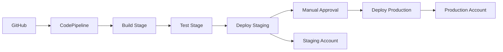

I'll help you create a comprehensive CloudFormation template for your multi-account CI/CD pipeline. This is indeed a complex setup, but I'll break it down into manageable pieces with clear explanations.

# Multi-Account CI/CD Pipeline Solution

## Overview

This solution creates a CodePipeline that deploys across multiple AWS accounts using cross-account IAM roles. The key to making this work is setting up proper trust relationships and permissions between accounts.

## Architecture Components



## CloudFormation Template

Here's the complete template with detailed explanations:

```yaml
AWSTemplateFormatVersion: '2010-09-09'
Description: 'Multi-Account CI/CD Pipeline for Web App Deployment'

Parameters:
  GitHubOwner:
    Type: String
    Description: GitHub repository owner
    Default: your-github-org

  GitHubRepo:
    Type: String
    Description: GitHub repository name
    Default: your-web-app

  GitHubBranch:
    Type: String
    Description: GitHub branch to track
    Default: main

  StagingAccountId:
    Type: String
    Description: AWS Account ID for staging environment
    AllowedPattern: '[0-9]{12}'

  ProductionAccountId:
    Type: String
    Description: AWS Account ID for production environment
    AllowedPattern: '[0-9]{12}'

  SlackChannelId:
    Type: String
    Description: Slack channel ID for notifications
    Default: C1234567890

  SlackWorkspaceId:
    Type: String
    Description: Slack workspace ID
    Default: T1234567890

  ApprovalEmailList:
    Type: CommaDelimitedList
    Description: Email addresses for manual approval notifications
    Default: 'devops@company.com,lead@company.com'

Resources:
  # =====================================================
  # S3 BUCKET FOR PIPELINE ARTIFACTS
  # =====================================================
  PipelineArtifactsBucket:
    Type: AWS::S3::Bucket
    Properties:
      BucketName: !Sub '${AWS::StackName}-pipeline-artifacts-${AWS::AccountId}'
      VersioningConfiguration:
        Status: Enabled
      BucketEncryption:
        ServerSideEncryptionConfiguration:
          - ServerSideEncryptionByDefault:
              SSEAlgorithm: AES256
      PublicAccessBlockConfiguration:
        BlockPublicAcls: true
        BlockPublicPolicy: true
        IgnorePublicAcls: true
        RestrictPublicBuckets: true
      LifecycleConfiguration:
        Rules:
          - Id: DeleteOldArtifacts
            Status: Enabled
            ExpirationInDays: 30

  # =====================================================
  # CODEPIPELINE SERVICE ROLE
  # =====================================================
  CodePipelineServiceRole:
    Type: AWS::IAM::Role
    Properties:
      RoleName: !Sub '${AWS::StackName}-CodePipeline-ServiceRole'
      AssumeRolePolicyDocument:
        Version: '2012-10-17'
        Statement:
          - Effect: Allow
            Principal:
              Service: codepipeline.amazonaws.com
            Action: sts:AssumeRole
      ManagedPolicyArns:
        - arn:aws:iam::aws:policy/AWSCodePipelineServiceRole
      Policies:
        - PolicyName: PipelineExecutionPolicy
          PolicyDocument:
            Version: '2012-10-17'
            Statement:
              # S3 permissions for artifacts
              - Effect: Allow
                Action:
                  - s3:GetObject
                  - s3:GetObjectVersion
                  - s3:PutObject
                  - s3:GetBucketVersioning
                Resource:
                  - !Sub '${PipelineArtifactsBucket}/*'
                  - !GetAtt PipelineArtifactsBucket.Arn
              # CodeBuild permissions
              - Effect: Allow
                Action:
                  - codebuild:BatchGetBuilds
                  - codebuild:StartBuild
                Resource:
                  - !GetAtt BuildProject.Arn
                  - !GetAtt TestProject.Arn
              # CloudFormation permissions
              - Effect: Allow
                Action:
                  - cloudformation:CreateStack
                  - cloudformation:DeleteStack
                  - cloudformation:DescribeStacks
                  - cloudformation:UpdateStack
                  - cloudformation:CreateChangeSet
                  - cloudformation:DeleteChangeSet
                  - cloudformation:DescribeChangeSet
                  - cloudformation:ExecuteChangeSet
                  - cloudformation:SetStackPolicy
                  - cloudformation:ValidateTemplate
                Resource: '*'
              # Cross-account role assumption
              - Effect: Allow
                Action: sts:AssumeRole
                Resource:
                  - !Sub 'arn:aws:iam::${StagingAccountId}:role/CrossAccountDeploymentRole'
                  - !Sub 'arn:aws:iam::${ProductionAccountId}:role/CrossAccountDeploymentRole'
              # SNS for manual approval
              - Effect: Allow
                Action:
                  - sns:Publish
                Resource: !Ref ManualApprovalTopic

  # =====================================================
  # CODEBUILD ROLES AND PROJECTS
  # =====================================================
  CodeBuildServiceRole:
    Type: AWS::IAM::Role
    Properties:
      RoleName: !Sub '${AWS::StackName}-CodeBuild-ServiceRole'
      AssumeRolePolicyDocument:
        Version: '2012-10-17'
        Statement:
          - Effect: Allow
            Principal:
              Service: codebuild.amazonaws.com
            Action: sts:AssumeRole
      ManagedPolicyArns:
        - arn:aws:iam::aws:policy/CloudWatchLogsFullAccess
      Policies:
        - PolicyName: CodeBuildExecutionPolicy
          PolicyDocument:
            Version: '2012-10-17'
            Statement:
              - Effect: Allow
                Action:
                  - s3:GetObject
                  - s3:GetObjectVersion
                  - s3:PutObject
                Resource: !Sub '${PipelineArtifactsBucket}/*'
              - Effect: Allow
                Action:
                  - logs:CreateLogGroup
                  - logs:CreateLogStream
                  - logs:PutLogEvents
                Resource: '*'

  BuildProject:
    Type: AWS::CodeBuild::Project
    Properties:
      Name: !Sub '${AWS::StackName}-Build'
      Description: 'Build stage for web application'
      ServiceRole: !GetAtt CodeBuildServiceRole.Arn
      Artifacts:
        Type: CODEPIPELINE
      Environment:
        Type: LINUX_CONTAINER
        ComputeType: BUILD_GENERAL1_MEDIUM
        Image: aws/codebuild/amazonlinux2-x86_64-standard:3.0
        EnvironmentVariables:
          - Name: AWS_DEFAULT_REGION
            Value: !Ref AWS::Region
          - Name: AWS_ACCOUNT_ID
            Value: !Ref AWS::AccountId
      Source:
        Type: CODEPIPELINE
        BuildSpec: |
          version: 0.2
          phases:
            pre_build:
              commands:
                - echo Logging in to Amazon ECR...
                - aws --version
                - echo Build started on `date`
            build:
              commands:
                - echo Build phase started on `date`
                - # Add your build commands here
                - npm install
                - npm run build
            post_build:
              commands:
                - echo Build completed on `date`
          artifacts:
            files:
              - '**/*'

  TestProject:
    Type: AWS::CodeBuild::Project
    Properties:
      Name: !Sub '${AWS::StackName}-Test'
      Description: 'Test stage for web application'
      ServiceRole: !GetAtt CodeBuildServiceRole.Arn
      Artifacts:
        Type: CODEPIPELINE
      Environment:
        Type: LINUX_CONTAINER
        ComputeType: BUILD_GENERAL1_MEDIUM
        Image: aws/codebuild/amazonlinux2-x86_64-standard:3.0
      Source:
        Type: CODEPIPELINE
        BuildSpec: |
          version: 0.2
          phases:
            pre_build:
              commands:
                - echo Test phase started on `date`
            build:
              commands:
                - echo Running tests...
                - npm test
                - npm run test:integration
            post_build:
              commands:
                - echo Tests completed on `date`

  # =====================================================
  # SNS TOPIC FOR MANUAL APPROVAL
  # =====================================================
  ManualApprovalTopic:
    Type: AWS::SNS::Topic
    Properties:
      TopicName: !Sub '${AWS::StackName}-ManualApproval'
      DisplayName: 'Pipeline Manual Approval Required'

  ManualApprovalSubscription:
    Type: AWS::SNS::Subscription
    Properties:
      Protocol: email
      TopicArn: !Ref ManualApprovalTopic
      Endpoint: !Select [0, !Ref ApprovalEmailList]

  # =====================================================
  # CHATBOT FOR SLACK NOTIFICATIONS
  # =====================================================
  SlackNotificationTopic:
    Type: AWS::SNS::Topic
    Properties:
      TopicName: !Sub '${AWS::StackName}-SlackNotifications'
      DisplayName: 'Pipeline Notifications'

  ChatbotRole:
    Type: AWS::IAM::Role
    Properties:
      RoleName: !Sub '${AWS::StackName}-Chatbot-Role'
      AssumeRolePolicyDocument:
        Version: '2012-10-17'
        Statement:
          - Effect: Allow
            Principal:
              Service: chatbot.amazonaws.com
            Action: sts:AssumeRole
      ManagedPolicyArns:
        - arn:aws:iam::aws:policy/CloudWatchReadOnlyAccess

  SlackChatbot:
    Type: AWS::Chatbot::SlackChannelConfiguration
    Properties:
      ConfigurationName: !Sub '${AWS::StackName}-slack-notifications'
      SlackChannelId: !Ref SlackChannelId
      SlackWorkspaceId: !Ref SlackWorkspaceId
      IamRoleArn: !GetAtt ChatbotRole.Arn
      SnsTopicArns:
        - !Ref SlackNotificationTopic
      LoggingLevel: ERROR

  # =====================================================
  # EVENTBRIDGE RULE FOR PIPELINE STATE CHANGES
  # =====================================================
  PipelineEventRule:
    Type: AWS::Events::Rule
    Properties:
      Name: !Sub '${AWS::StackName}-pipeline-events'
      Description: 'Capture pipeline state changes'
      EventPattern:
        source:
          - aws.codepipeline
        detail-type:
          - CodePipeline Pipeline Execution State Change
          - CodePipeline Stage Execution State Change
        detail:
          pipeline:
            - !Ref CodePipeline
          state:
            - FAILED
            - SUCCEEDED
      State: ENABLED
      Targets:
        - Arn: !Ref SlackNotificationTopic
          Id: SlackNotificationTarget

  # =====================================================
  # THE MAIN CODEPIPELINE
  # =====================================================
  CodePipeline:
    Type: AWS::CodePipeline::Pipeline
    Properties:
      Name: !Sub '${AWS::StackName}-Pipeline'
      RoleArn: !GetAtt CodePipelineServiceRole.Arn
      ArtifactStore:
        Type: S3
        Location: !Ref PipelineArtifactsBucket
      Stages:
        # SOURCE STAGE
        - Name: Source
          Actions:
            - Name: SourceAction
              ActionTypeId:
                Category: Source
                Owner: ThirdParty
                Provider: GitHub
                Version: '1'
              Configuration:
                Owner: !Ref GitHubOwner
                Repo: !Ref GitHubRepo
                Branch: !Ref GitHubBranch
                # Note: You'll need to set up OAuth token in CodePipeline console
                # or use GitHub App/webhook for production use
                PollForSourceChanges: false
              OutputArtifacts:
                - Name: SourceOutput

        # BUILD STAGE
        - Name: Build
          Actions:
            - Name: BuildAction
              ActionTypeId:
                Category: Build
                Owner: AWS
                Provider: CodeBuild
                Version: '1'
              Configuration:
                ProjectName: !Ref BuildProject
              InputArtifacts:
                - Name: SourceOutput
              OutputArtifacts:
                - Name: BuildOutput

        # TEST STAGE
        - Name: Test
          Actions:
            - Name: TestAction
              ActionTypeId:
                Category: Build
                Owner: AWS
                Provider: CodeBuild
                Version: '1'
              Configuration:
                ProjectName: !Ref TestProject
              InputArtifacts:
                - Name: BuildOutput
              OutputArtifacts:
                - Name: TestOutput

        # STAGING DEPLOYMENT
        - Name: DeployStaging
          Actions:
            - Name: CreateStagingChangeSet
              ActionTypeId:
                Category: Deploy
                Owner: AWS
                Provider: CloudFormation
                Version: '1'
              Configuration:
                ActionMode: CHANGE_SET_REPLACE
                StackName: Staging-WebApp-Stack
                ChangeSetName: Staging-WebApp-ChangeSet
                TemplatePath: TestOutput::infrastructure/app-template.yaml
                Capabilities: CAPABILITY_IAM,CAPABILITY_NAMED_IAM
                RoleArn: !Sub 'arn:aws:iam::${StagingAccountId}:role/CrossAccountDeploymentRole'
                ParameterOverrides: |
                  {
                    "Environment": "staging",
                    "ResourcePrefix": "Staging-"
                  }
              InputArtifacts:
                - Name: TestOutput
              Region: us-east-1
              RunOrder: 1
            - Name: ExecuteStagingChangeSet
              ActionTypeId:
                Category: Deploy
                Owner: AWS
                Provider: CloudFormation
                Version: '1'
              Configuration:
                ActionMode: CHANGE_SET_EXECUTE
                StackName: Staging-WebApp-Stack
                ChangeSetName: Staging-WebApp-ChangeSet
                RoleArn: !Sub 'arn:aws:iam::${StagingAccountId}:role/CrossAccountDeploymentRole'
              Region: us-east-1
              RunOrder: 2

        # MANUAL APPROVAL
        - Name: ManualApproval
          Actions:
            - Name: ApprovalAction
              ActionTypeId:
                Category: Approval
                Owner: AWS
                Provider: Manual
                Version: '1'
              Configuration:
                NotificationArn: !Ref ManualApprovalTopic
                CustomData: 'Please review the staging deployment and approve for production release.'

        # PRODUCTION DEPLOYMENT
        - Name: DeployProduction
          Actions:
            - Name: CreateProductionChangeSet
              ActionTypeId:
                Category: Deploy
                Owner: AWS
                Provider: CloudFormation
                Version: '1'
              Configuration:
                ActionMode: CHANGE_SET_REPLACE
                StackName: Prod-WebApp-Stack
                ChangeSetName: Prod-WebApp-ChangeSet
                TemplatePath: TestOutput::infrastructure/app-template.yaml
                Capabilities: CAPABILITY_IAM,CAPABILITY_NAMED_IAM
                RoleArn: !Sub 'arn:aws:iam::${ProductionAccountId}:role/CrossAccountDeploymentRole'
                ParameterOverrides: |
                  {
                    "Environment": "production",
                    "ResourcePrefix": "Prod-"
                  }
              InputArtifacts:
                - Name: TestOutput
              Region: us-east-1
              RunOrder: 1
            - Name: ExecuteProductionChangeSet
              ActionTypeId:
                Category: Deploy
                Owner: AWS
                Provider: CloudFormation
                Version: '1'
              Configuration:
                ActionMode: CHANGE_SET_EXECUTE
                StackName: Prod-WebApp-Stack
                ChangeSetName: Prod-WebApp-ChangeSet
                RoleArn: !Sub 'arn:aws:iam::${ProductionAccountId}:role/CrossAccountDeploymentRole'
              Region: us-east-1
              RunOrder: 2

  # =====================================================
  # GITHUB WEBHOOK (OPTIONAL - FOR AUTOMATIC TRIGGERS)
  # =====================================================
  GitHubWebhook:
    Type: AWS::CodePipeline::Webhook
    Properties:
      Name: !Sub '${AWS::StackName}-github-webhook'
      Authentication: GITHUB_HMAC
      AuthenticationConfiguration:
        SecretToken: !Ref GitHubWebhookSecret
      Filters:
        - JsonPath: $.ref
          MatchEquals: !Sub 'refs/heads/${GitHubBranch}'
      TargetPipeline: !Ref CodePipeline
      TargetAction: SourceAction
      TargetPipelineVersion: !GetAtt CodePipeline.Version
      RegisterWithThirdParty: true

  GitHubWebhookSecret:
    Type: AWS::SecretsManager::Secret
    Properties:
      Name: !Sub '${AWS::StackName}-github-webhook-secret'
      Description: 'Secret for GitHub webhook authentication'
      GenerateSecretString:
        SecretStringTemplate: '{}'
        GenerateStringKey: 'token'
        PasswordLength: 32
        ExcludeCharacters: '"@/\'

Outputs:
  PipelineName:
    Description: 'Name of the created CodePipeline'
    Value: !Ref CodePipeline
    Export:
      Name: !Sub '${AWS::StackName}-PipelineName'

  PipelineUrl:
    Description: 'URL of the CodePipeline in AWS Console'
    Value: !Sub 'https://console.aws.amazon.com/codesuite/codepipeline/pipelines/${CodePipeline}/view'

  ArtifactsBucket:
    Description: 'S3 bucket for pipeline artifacts'
    Value: !Ref PipelineArtifactsBucket
    Export:
      Name: !Sub '${AWS::StackName}-ArtifactsBucket'

  CrossAccountRoleInstructions:
    Description: 'Instructions for setting up cross-account roles'
    Value: !Sub |
      Create the following IAM role in both staging (${StagingAccountId}) and production (${ProductionAccountId}) accounts:
      Role Name: CrossAccountDeploymentRole
      Trust Policy: Allow ${AWS::AccountId} to assume this role
      Permissions: CloudFormation and related service permissions
```

## Cross-Account IAM Role Setup

You need to create this role in **both** your staging and production accounts:

### Role Template for Target Accounts

```yaml
# Deploy this in STAGING and PRODUCTION accounts
AWSTemplateFormatVersion: '2010-09-09'
Description: 'Cross-account deployment role for CI/CD pipeline'

Parameters:
  PipelineAccountId:
    Type: String
    Description: AWS Account ID where the pipeline runs
    AllowedPattern: '[0-9]{12}'

Resources:
  CrossAccountDeploymentRole:
    Type: AWS::IAM::Role
    Properties:
      RoleName: CrossAccountDeploymentRole
      AssumeRolePolicyDocument:
        Version: '2012-10-17'
        Statement:
          - Effect: Allow
            Principal:
              AWS: !Sub 'arn:aws:iam::${PipelineAccountId}:role/*-CodePipeline-ServiceRole'
            Action: sts:AssumeRole
            Condition:
              StringEquals:
                'sts:ExternalId': 'cross-account-deployment'
      ManagedPolicyArns:
        - arn:aws:iam::aws:policy/PowerUserAccess
      Policies:
        - PolicyName: CloudFormationDeploymentPolicy
          PolicyDocument:
            Version: '2012-10-17'
            Statement:
              - Effect: Allow
                Action:
                  - iam:CreateRole
                  - iam:DeleteRole
                  - iam:GetRole
                  - iam:PassRole
                  - iam:AttachRolePolicy
                  - iam:DetachRolePolicy
                  - iam:PutRolePolicy
                  - iam:DeleteRolePolicy
                  - iam:GetRolePolicy
                  - iam:CreateInstanceProfile
                  - iam:DeleteInstanceProfile
                  - iam:AddRoleToInstanceProfile
                  - iam:RemoveRoleFromInstanceProfile
                Resource: '*'
```

## Deployment Instructions

### 1. Deploy Cross-Account Roles First

```bash
# In staging account
aws cloudformation deploy \
  --template-file cross-account-role.yaml \
  --stack-name CrossAccountDeploymentRole \
  --parameter-overrides PipelineAccountId=123456789012 \
  --capabilities CAPABILITY_NAMED_IAM \
  --profile staging-account

# In production account
aws cloudformation deploy \
  --template-file cross-account-role.yaml \
  --stack-name CrossAccountDeploymentRole \
  --parameter-overrides PipelineAccountId=123456789012 \
  --capabilities CAPABILITY_NAMED_IAM \
  --profile production-account
```

### 2. Deploy the Main Pipeline

```bash
# In pipeline account (tools/shared services account)
aws cloudformation deploy \
  --template-file pipeline.yaml \
  --stack-name WebApp-CICD-Pipeline \
  --parameter-overrides \
    StagingAccountId=111111111111 \
    ProductionAccountId=222222222222 \
    GitHubOwner=your-org \
    GitHubRepo=your-repo \
    SlackChannelId=C1234567890 \
    SlackWorkspaceId=T1234567890 \
  --capabilities CAPABILITY_NAMED_IAM
```

## Key Security Features

1. **Least Privilege**: Each role has only the minimum permissions needed
2. **Cross-Account Isolation**: Staging and production are completely separate
3. **Change Sets**: All deployments use CloudFormation change sets for review
4. **Manual Approval**: Human verification required before production
5. **Encryption**: S3 artifacts are encrypted at rest
6. **Audit Trail**: All actions are logged via CloudTrail

## Troubleshooting Common Issues

### Cross-Account Role Assumption Failures

- Verify the trust policy allows the pipeline account to assume the role
- Check that the role names match exactly in the pipeline configuration
- Ensure the pipeline service role has `sts:AssumeRole` permissions

### GitHub Integration Issues

- Set up OAuth token in CodePipeline console for private repos
- For production, consider using GitHub Apps instead of personal access tokens
- Webhook secret must match between GitHub and AWS

### Change Set Failures

- Verify the CloudFormation template path in your artifacts
- Check that the target account role has sufficient CloudFormation permissions
- Ensure parameter overrides are valid JSON

This template provides a production-ready, secure, and maintainable CI/CD pipeline that your team can easily understand and modify. The cross-account setup ensures proper isolation while maintaining deployment automation.
