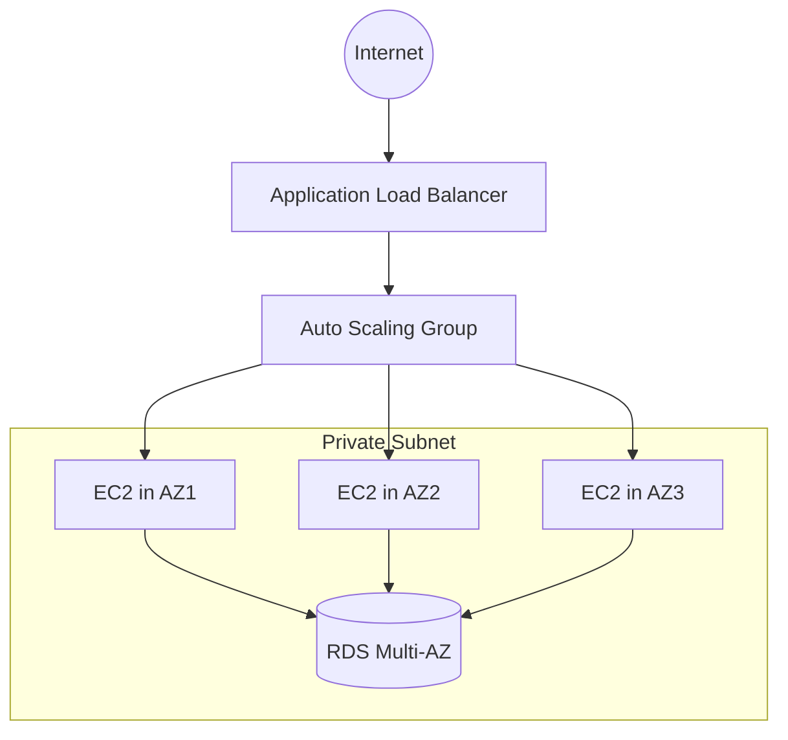

# High-Availability Web Application Infrastructure

## 📋 Architecture Overview



## 🎯 Template Structure

```yaml
AWSTemplateFormatVersion: '2010-09-09'
Description: Highly available multi-tier web application infrastructure
```

## 🔧 Parameters

```yaml
Parameters:
  EnvName:
    Type: String
    Description: Environment name (e.g., dev, prod)
  InstanceType:
    Type: String
    Default: t3.medium
    Description: EC2 instance type
  DBEngine:
    Type: String
    Default: mysql
    AllowedValues: [mysql, postgresql]
    Description: Database engine type
  DBName:
    Type: String
    Default: hrdb
    Description: Database name
```

## 🏗️ Infrastructure Components

### Network Layer

```yaml
VPC:
  Type: AWS::EC2::VPC
  Properties:
    CidrBlock: 10.0.0.0/16
    Tags: [{ Key: Name, Value: !Sub 'hr-${EnvName}-vpc' }]

InternetGateway:
  Type: AWS::EC2::InternetGateway
  Properties:
    Tags: [{ Key: Name, Value: !Sub 'hr-${EnvName}-igw' }]

IGWAttachment:
  Type: AWS::EC2::VPCGatewayAttachment
  Properties:
    VpcId: !Ref VPC
    InternetGatewayId: !Ref InternetGateway

PublicSubnets:
  Type: AWS::EC2::Subnet
  Properties:
    VpcId: !Ref VPC
    CidrBlock:
      !Select [!Ref 'AWS::NoValue', !Cidr [!GetAtt VPC.CidrBlock, 4, 8]]
    AvailabilityZone: !Select [!Ref 'AWS::NoValue', !GetAZs '']
    MapPublicIpOnLaunch: true
    Tags:
      [
        {
          Key: Name,
          Value: !Sub 'hr-${EnvName}-public-subnet-${AWS::Region}-${AWS::NoValue}',
        },
      ]

PrivateSubnets:
  Type: AWS::EC2::Subnet
  Properties:
    VpcId: !Ref VPC
    CidrBlock:
      !Select [!Ref 'AWS::NoValue', !Cidr [!GetAtt VPC.CidrBlock, 4, 16]]
    AvailabilityZone: !Select [!Ref 'AWS::NoValue', !GetAZs '']
    Tags:
      [
        {
          Key: Name,
          Value: !Sub 'hr-${EnvName}-private-subnet-${AWS::Region}-${AWS::NoValue}',
        },
      ]

NATGateways:
  Type: AWS::EC2::NatGateway
  Properties:
    AllocationId: !GetAtt [EIP, AllocationId]
    SubnetId: !Select [!Ref 'AWS::NoValue', !Ref PublicSubnets]
    Tags:
      [
        {
          Key: Name,
          Value: !Sub 'hr-${EnvName}-nat-${AWS::Region}-${AWS::NoValue}',
        },
      ]

EIP:
  Type: AWS::EC2::EIP
  DependsOn: InternetGateway

RouteTable:
  Type: AWS::EC2::RouteTable
  Properties:
    VpcId: !Ref VPC
    Tags: [{ Key: Name, Value: !Sub 'hr-${EnvName}-rt' }]

PublicRoute:
  Type: AWS::EC2::Route
  Properties:
    RouteTableId: !Ref RouteTable
    DestinationCidrBlock: 0.0.0.0/0
    GatewayId: !Ref InternetGateway

PrivateRouteTables:
  Type: AWS::EC2::RouteTable
  Properties:
    VpcId: !Ref VPC
    Tags:
      [{ Key: Name, Value: !Sub 'hr-${EnvName}-private-rt-${AWS::NoValue}' }]

PrivateRoutes:
  Type: AWS::EC2::Route
  Properties:
    RouteTableId: !Ref PrivateRouteTables
    DestinationCidrBlock: 0.0.0.0/0
    NatGatewayId: !Ref NATGateways
```

### Compute Layer

```yaml
WebSecurityGroup:
  Type: AWS::EC2::SecurityGroup
  Properties:
    GroupDescription: Allow HTTP/HTTPS
    VpcId: !Ref VPC
    SecurityGroupIngress:
      - IpProtocol: tcp
        FromPort: 80
        ToPort: 80
        CidrIp: 0.0.0.0/0
      - IpProtocol: tcp
        FromPort: 443
        ToPort: 443
        CidrIp: 0.0.0.0/0

DBSecurityGroup:
  Type: AWS::EC2::SecurityGroup
  Properties:
    GroupDescription: Allow DB traffic
    VpcId: !Ref VPC

LaunchTemplate:
  Type: AWS::EC2::LaunchTemplate
  Properties:
    LaunchTemplateName: !Sub 'hr-${EnvName}-lt'
    LaunchTemplateData:
      InstanceType: !Ref InstanceType
      ImageId: ami-0abcdef1234567890
      IamInstanceProfile:
        Arn: !GetAtt EC2InstanceRole.Arn
      SecurityGroupIds: [!Ref WebSecurityGroup]

AutoScalingGroup:
  Type: AWS::AutoScaling::AutoScalingGroup
  Properties:
    VPCZoneIdentifier: !Ref PrivateSubnets
    LaunchTemplate:
      LaunchTemplateName: !Ref LaunchTemplate
      Version: !GetAtt LaunchTemplate.LatestVersionNumber
    MinSize: 2
    MaxSize: 6
    DesiredCapacity: 2

ALB:
  Type: AWS::ElasticLoadBalancingV2::LoadBalancer
  Properties:
    Subnets: !Ref PublicSubnets
    SecurityGroups: [!Ref WebSecurityGroup]
    Scheme: internet-facing
```

### Database Layer

```yaml
RDSInstance:
  Type: AWS::RDS::DBInstance
  Properties:
    DBName: !Ref DBName
    Engine: !Ref DBEngine
    MultiAZ: true
    DBSubnetGroupName: !Ref DBSubnetGroup
    VPCSecurityGroups: [!Ref DBSecurityGroup]

DBSubnetGroup:
  Type: AWS::RDS::DBSubnetGroup
  Properties:
    DBSubnetGroupDescription: Private subnets
    SubnetIds: !Ref PrivateSubnets
```

## 🔒 Security Components

### IAM Roles

```yaml
BackupRole:
  Type: AWS::IAM::Role
  Properties:
    AssumeRolePolicyDocument:
      Version: '2012-10-17'
      Statement:
        - Effect: Allow
          Principal: { Service: backup.amazonaws.com }
          Action: sts:AssumeRole

EC2InstanceRole:
  Type: AWS::IAM::Role
  Properties:
    AssumeRolePolicyDocument:
      Version: '2012-10-17'
      Statement:
        - Effect: Allow
          Principal: { Service: ec2.amazonaws.com }
          Action: sts:AssumeRole
```

### Security Groups

```yaml
WebSecurityGroup:
  Type: AWS::EC2::SecurityGroup
  Properties:
    GroupDescription: Allow HTTP/HTTPS
    VpcId: !Ref VPC
    SecurityGroupIngress:
      - IpProtocol: tcp
        FromPort: 80
        ToPort: 80
        CidrIp: 0.0.0.0/0
      - IpProtocol: tcp
        FromPort: 443
        ToPort: 443
        CidrIp: 0.0.0.0/0

DBSecurityGroup:
  Type: AWS::EC2::SecurityGroup
  Properties:
    GroupDescription: Allow DB traffic
    VpcId: !Ref VPC
```

## 📊 Outputs

```yaml
Outputs:
  ALBDNSName:
    Description: ALB DNS Name
    Value: !GetAtt ALB.DNSName

  RDSEndpoint:
    Description: RDS Endpoint
    Value: !GetAtt RDSInstance.Endpoint.Address

  EC2InstanceRoleName:
    Description: EC2 Instance Role Name
    Value: !Ref EC2InstanceRole
```

## 🚀 Deployment Guide

```bash
# Deploy the stack
aws cloudformation create-stack \
  --stack-name web-app-stack \
  --template-body file://template.yaml \
  --parameters ParameterKey=EnvName,ParameterValue=dev
```
