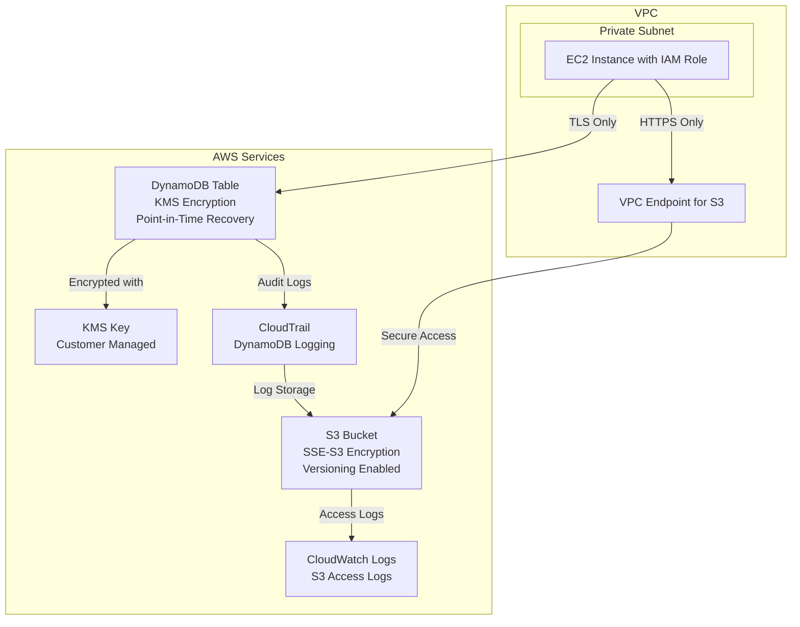

# AWS Security Infrastructure Implementation Guide

I'll create a comprehensive CloudFormation template that meets all your security requirements for S3 and DynamoDB resources.

## Complete CloudFormation Template

```yaml
AWSTemplateFormatVersion: '2010-09-01'
Description: 'Secure S3 and DynamoDB Infrastructure with comprehensive security controls'

Parameters:
  VpcId:
    Type: AWS::EC2::VPC::Id
    Description: VPC where resources will be deployed

  AllowedRoleArn:
    Type: String
    Description: ARN of IAM role allowed to access resources
    AllowedPattern: '^arn:aws:iam::[0-9]{12}:role/.+$'
    ConstraintDescription: Must be a valid IAM role ARN

  BucketName:
    Type: String
    Description: Name for the S3 bucket (must be globally unique)
    Default: secure-storage-bucket
    AllowedPattern: '^[a-z0-9][a-z0-9-]*[a-z0-9]$'
    ConstraintDescription: Must be a valid S3 bucket name

  TableName:
    Type: String
    Description: Name for the DynamoDB table
    Default: SecureDataTable
    AllowedPattern: '^[a-zA-Z0-9_.-]+$'
    ConstraintDescription: Must be a valid DynamoDB table name

Resources:
  # KMS Key for DynamoDB encryption
  DynamoDBKMSKey:
    Type: AWS::KMS::Key
    Properties:
      Description: KMS key for DynamoDB table encryption
      KeyPolicy:
        Version: '2012-10-17'
        Statement:
          - Sid: Enable IAM User Permissions
            Effect: Allow
            Principal:
              AWS: !Sub 'arn:aws:iam::${AWS::AccountId}:root'
            Action: 'kms:*'
            Resource: '*'
          - Sid: Allow DynamoDB Service
            Effect: Allow
            Principal:
              Service: dynamodb.amazonaws.com
            Action:
              - kms:Decrypt
              - kms:DescribeKey
              - kms:Encrypt
              - kms:GenerateDataKey*
              - kms:ReEncrypt*
            Resource: '*'
          - Sid: Allow access for specified role
            Effect: Allow
            Principal:
              AWS: !Ref AllowedRoleArn
            Action:
              - kms:Decrypt
              - kms:DescribeKey
              - kms:Encrypt
              - kms:GenerateDataKey*
              - kms:ReEncrypt*
            Resource: '*'
      Tags:
        - Key: Environment
          Value: Production
        - Key: Purpose
          Value: DynamoDB-Encryption

  # KMS Key Alias
  DynamoDBKMSKeyAlias:
    Type: AWS::KMS::Alias
    Properties:
      AliasName: alias/dynamodb-secure-storage
      TargetKeyId: !Ref DynamoDBKMSKey

  # VPC Endpoint for S3
  S3VPCEndpoint:
    Type: AWS::EC2::VPCEndpoint
    Properties:
      VpcId: !Ref VpcId
      ServiceName: !Sub 'com.amazonaws.${AWS::Region}.s3'
      VpcEndpointType: Gateway
      PolicyDocument:
        Version: '2012-10-17'
        Statement:
          - Effect: Allow
            Principal: '*'
            Action:
              - s3:GetObject
              - s3:PutObject
              - s3:DeleteObject
              - s3:ListBucket
            Resource:
              - !Sub '${SecureS3Bucket}/*'
              - !Ref SecureS3Bucket
            Condition:
              StringEquals:
                'aws:PrincipalArn': !Ref AllowedRoleArn

  # S3 Bucket
  SecureS3Bucket:
    Type: AWS::S3::Bucket
    Properties:
      BucketName: !Sub '${BucketName}-${AWS::AccountId}-${AWS::Region}'
      BucketEncryption:
        ServerSideEncryptionConfiguration:
          - ServerSideEncryptionByDefault:
              SSEAlgorithm: AES256
            BucketKeyEnabled: true
      VersioningConfiguration:
        Status: Enabled
      PublicAccessBlockConfiguration:
        BlockPublicAcls: true
        BlockPublicPolicy: true
        IgnorePublicAcls: true
        RestrictPublicBuckets: true
      NotificationConfiguration:
        CloudWatchConfigurations:
          - Event: s3:ObjectCreated:*
            CloudWatchConfiguration:
              LogGroupName: !Ref S3LogGroup
      LoggingConfiguration:
        DestinationBucketName: !Ref S3AccessLogsBucket
        LogFilePrefix: access-logs/
      Tags:
        - Key: Environment
          Value: Production
        - Key: Purpose
          Value: Secure-Storage

  # S3 Access Logs Bucket
  S3AccessLogsBucket:
    Type: AWS::S3::Bucket
    Properties:
      BucketName: !Sub '${BucketName}-access-logs-${AWS::AccountId}-${AWS::Region}'
      BucketEncryption:
        ServerSideEncryptionConfiguration:
          - ServerSideEncryptionByDefault:
              SSEAlgorithm: AES256
      PublicAccessBlockConfiguration:
        BlockPublicAcls: true
        BlockPublicPolicy: true
        IgnorePublicAcls: true
        RestrictPublicBuckets: true
      LifecycleConfiguration:
        Rules:
          - Id: DeleteOldLogs
            Status: Enabled
            ExpirationInDays: 90
      Tags:
        - Key: Environment
          Value: Production
        - Key: Purpose
          Value: Access-Logs

  # S3 Bucket Policy
  SecureS3BucketPolicy:
    Type: AWS::S3::BucketPolicy
    Properties:
      Bucket: !Ref SecureS3Bucket
      PolicyDocument:
        Version: '2012-10-17'
        Statement:
          - Sid: DenyInsecureConnections
            Effect: Deny
            Principal: '*'
            Action: 's3:*'
            Resource:
              - !Sub '${SecureS3Bucket}/*'
              - !Ref SecureS3Bucket
            Condition:
              Bool:
                'aws:SecureTransport': 'false'
          - Sid: AllowVPCEndpointAccess
            Effect: Allow
            Principal:
              AWS: !Ref AllowedRoleArn
            Action:
              - s3:GetObject
              - s3:PutObject
              - s3:DeleteObject
              - s3:ListBucket
              - s3:GetBucketVersioning
              - s3:GetObjectVersion
            Resource:
              - !Sub '${SecureS3Bucket}/*'
              - !Ref SecureS3Bucket
            Condition:
              StringEquals:
                'aws:SourceVpce': !Ref S3VPCEndpoint

  # CloudWatch Log Group for S3
  S3LogGroup:
    Type: AWS::Logs::LogGroup
    Properties:
      LogGroupName: !Sub '/aws/s3/${BucketName}'
      RetentionInDays: 30
      Tags:
        - Key: Environment
          Value: Production
        - Key: Purpose
          Value: S3-Logging

  # DynamoDB Table
  SecureDynamoDBTable:
    Type: AWS::DynamoDB::Table
    Properties:
      TableName: !Ref TableName
      BillingMode: PAY_PER_REQUEST
      AttributeDefinitions:
        - AttributeName: id
          AttributeType: S
      KeySchema:
        - AttributeName: id
          KeyType: HASH
      SSESpecification:
        SSEEnabled: true
        KMSMasterKeyId: !Ref DynamoDBKMSKey
      PointInTimeRecoverySpecification:
        PointInTimeRecoveryEnabled: true
      StreamSpecification:
        StreamViewType: NEW_AND_OLD_IMAGES
      Tags:
        - Key: Environment
          Value: Production
        - Key: Purpose
          Value: Secure-Storage

  # CloudTrail for DynamoDB logging
  DynamoDBCloudTrail:
    Type: AWS::CloudTrail::Trail
    Properties:
      TrailName: !Sub 'dynamodb-${TableName}-trail'
      S3BucketName: !Ref CloudTrailLogsBucket
      S3KeyPrefix: dynamodb-logs/
      IncludeGlobalServiceEvents: false
      IsMultiRegionTrail: false
      EnableLogFileValidation: true
      EventSelectors:
        - ReadWriteType: All
          IncludeManagementEvents: false
          DataResources:
            - Type: AWS::DynamoDB::Table
              Values:
                - !Sub '${SecureDynamoDBTable}/*'
      Tags:
        - Key: Environment
          Value: Production
        - Key: Purpose
          Value: DynamoDB-Audit

  # CloudTrail Logs Bucket
  CloudTrailLogsBucket:
    Type: AWS::S3::Bucket
    Properties:
      BucketName: !Sub 'cloudtrail-logs-${AWS::AccountId}-${AWS::Region}'
      BucketEncryption:
        ServerSideEncryptionConfiguration:
          - ServerSideEncryptionByDefault:
              SSEAlgorithm: AES256
      PublicAccessBlockConfiguration:
        BlockPublicAcls: true
        BlockPublicPolicy: true
        IgnorePublicAcls: true
        RestrictPublicBuckets: true
      LifecycleConfiguration:
        Rules:
          - Id: DeleteOldTrailLogs
            Status: Enabled
            ExpirationInDays: 365
      Tags:
        - Key: Environment
          Value: Production
        - Key: Purpose
          Value: CloudTrail-Logs

  # CloudTrail Logs Bucket Policy
  CloudTrailLogsBucketPolicy:
    Type: AWS::S3::BucketPolicy
    Properties:
      Bucket: !Ref CloudTrailLogsBucket
      PolicyDocument:
        Version: '2012-10-17'
        Statement:
          - Sid: AWSCloudTrailAclCheck
            Effect: Allow
            Principal:
              Service: cloudtrail.amazonaws.com
            Action: s3:GetBucketAcl
            Resource: !Ref CloudTrailLogsBucket
          - Sid: AWSCloudTrailWrite
            Effect: Allow
            Principal:
              Service: cloudtrail.amazonaws.com
            Action: s3:PutObject
            Resource: !Sub '${CloudTrailLogsBucket}/*'
            Condition:
              StringEquals:
                's3:x-amz-acl': bucket-owner-full-control
          - Sid: DenyInsecureConnections
            Effect: Deny
            Principal: '*'
            Action: 's3:*'
            Resource:
              - !Sub '${CloudTrailLogsBucket}/*'
              - !Ref CloudTrailLogsBucket
            Condition:
              Bool:
                'aws:SecureTransport': 'false'

  # IAM Policy for DynamoDB access
  DynamoDBAccessPolicy:
    Type: AWS::IAM::Policy
    Properties:
      PolicyName: SecureDynamoDBAccess
      PolicyDocument:
        Version: '2012-10-17'
        Statement:
          - Effect: Allow
            Action:
              - dynamodb:GetItem
              - dynamodb:PutItem
              - dynamodb:UpdateItem
              - dynamodb:DeleteItem
              - dynamodb:Query
              - dynamodb:Scan
              - dynamodb:BatchGetItem
              - dynamodb:BatchWriteItem
            Resource: !GetAtt SecureDynamoDBTable.Arn
            Condition:
              Bool:
                'aws:SecureTransport': 'true'
          - Effect: Allow
            Action:
              - kms:Decrypt
              - kms:GenerateDataKey
            Resource: !GetAtt DynamoDBKMSKey.Arn
      Roles:
        - !Select [
            1,
            !Split ['/', !Select [5, !Split [':', !Ref AllowedRoleArn]]],
          ]

Outputs:
  S3BucketName:
    Description: Name of the secure S3 bucket
    Value: !Ref SecureS3Bucket
    Export:
      Name: !Sub '${AWS::StackName}-S3Bucket'

  S3BucketArn:
    Description: ARN of the secure S3 bucket
    Value: !GetAtt SecureS3Bucket.Arn
    Export:
      Name: !Sub '${AWS::StackName}-S3BucketArn'

  DynamoDBTableName:
    Description: Name of the secure DynamoDB table
    Value: !Ref SecureDynamoDBTable
    Export:
      Name: !Sub '${AWS::StackName}-DynamoDBTable'

  DynamoDBTableArn:
    Description: ARN of the secure DynamoDB table
    Value: !GetAtt SecureDynamoDBTable.Arn
    Export:
      Name: !Sub '${AWS::StackName}-DynamoDBTableArn'

  KMSKeyId:
    Description: KMS Key ID for DynamoDB encryption
    Value: !Ref DynamoDBKMSKey
    Export:
      Name: !Sub '${AWS::StackName}-KMSKey'

  VPCEndpointId:
    Description: VPC Endpoint ID for S3 access
    Value: !Ref S3VPCEndpoint
    Export:
      Name: !Sub '${AWS::StackName}-S3VPCEndpoint'

  CloudTrailArn:
    Description: CloudTrail ARN for DynamoDB logging
    Value: !GetAtt DynamoDBCloudTrail.Arn
    Export:
      Name: !Sub '${AWS::StackName}-CloudTrail'
```

## Architecture Diagram



## Security Controls Implementation

### S3 Bucket Security Controls

1. **Server-side encryption using SSE-S3**: Implemented with AES256
2. **VPC endpoint access restrictions**: VPC endpoint with restrictive policy
3. **IAM role-based access control**: Bucket policy restricts access to specified role
4. **Versioning enabled**: Configured in bucket properties
5. **HTTPS-only access**: Bucket policy denies non-SSL requests
6. **Production environment tagging**: Environment=Production tag applied

### DynamoDB Security Controls

1. **KMS encryption enabled**: Customer-managed KMS key
2. **IAM role restrictions**: IAM policy attached to specified role only
3. **CloudTrail logging**: Dedicated CloudTrail for DynamoDB operations
4. **TLS enforcement**: IAM policy condition requires SecureTransport
5. **Production environment tagging**: Environment=Production tag applied

## Deployment Instructions

### 1. Template Validation

```bash
# Install cfn-lint (if not already installed)
pip install cfn-lint

# Validate the template
cfn-lint secure-infrastructure.yaml
```

### 2. Deploy the Stack

```bash
# Deploy using AWS CLI
aws cloudformation deploy \
  --template-file secure-infrastructure.yaml \
  --stack-name secure-storage-stack \
  --parameter-overrides \
    VpcId=vpc-0123456789abcdef0 \
    AllowedRoleArn=arn:aws:iam::123456789012:role/MySecureRole \
    BucketName=my-secure-bucket \
    TableName=MySecureTable \
  --capabilities CAPABILITY_IAM \
  --region us-east-1
```

### 3. Verify Deployment

```bash
# Check stack status
aws cloudformation describe-stacks \
  --stack-name secure-storage-stack \
  --query 'Stacks[0].StackStatus'

# Get outputs
aws cloudformation describe-stacks \
  --stack-name secure-storage-stack \
  --query 'Stacks[0].Outputs'
```

## Access Patterns

### S3 Access Pattern

```bash
# Access S3 through VPC endpoint only
aws s3 ls s3://your-bucket-name --region us-east-1
aws s3 cp file.txt s3://your-bucket-name/ --region us-east-1
```

### DynamoDB Access Pattern

```python
import boto3

# DynamoDB client with TLS
dynamodb = boto3.resource('dynamodb',
                         region_name='us-east-1',
                         use_ssl=True)

table = dynamodb.Table('MySecureTable')

# Put item
table.put_item(Item={'id': '123', 'data': 'secure data'})

# Get item
response = table.get_item(Key={'id': '123'})
```

## Compliance Verification Checklist

- [x] All data encrypted at rest (S3: SSE-S3, DynamoDB: KMS)
- [x] All data encrypted in transit (HTTPS/TLS only)
- [x] Access restricted to authorized IAM roles only
- [x] VPC endpoint configured for S3 access
- [x] Comprehensive logging enabled (CloudTrail, CloudWatch)
- [x] Versioning enabled for data recovery
- [x] Point-in-time recovery enabled for DynamoDB
- [x] Public access blocked on all S3 buckets
- [x] Production environment tags applied
- [x] Least privilege access policies implemented

This implementation provides a robust, secure infrastructure that meets all specified requirements and follows AWS security best practices.
