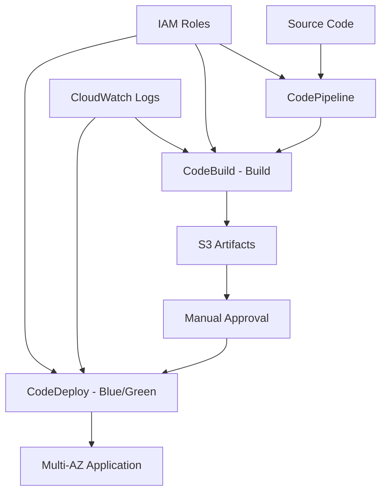

# Expert-Level CI/CD Pipeline with AWS CDK TypeScript

I'll create a comprehensive CI/CD pipeline solution using AWS CDK TypeScript that meets all your requirements. This solution implements blue-green deployments, multi-account support, and follows AWS best practices.

## Solution Architecture



## Complete CDK Stack Implementation

```typescript
// lib/ci-cd-pipeline-stack.ts
import * as cdk from 'aws-cdk-lib';
import * as codepipeline from 'aws-cdk-lib/aws-codepipeline';
import * as codepipelineActions from 'aws-cdk-lib/aws-codepipeline-actions';
import * as codebuild from 'aws-cdk-lib/aws-codebuild';
import * as codedeploy from 'aws-cdk-lib/aws-codedeploy';
import * as s3 from 'aws-cdk-lib/aws-s3';
import * as iam from 'aws-cdk-lib/aws-iam';
import * as ec2 from 'aws-cdk-lib/aws-ec2';
import * as autoscaling from 'aws-cdk-lib/aws-autoscaling';
import * as elbv2 from 'aws-cdk-lib/aws-elasticloadbalancingv2';
import * as logs from 'aws-cdk-lib/aws-logs';
import * as sns from 'aws-cdk-lib/aws-sns';
import * as subscriptions from 'aws-cdk-lib/aws-sns-subscriptions';
import { Construct } from 'constructs';

export interface CiCdPipelineStackProps extends cdk.StackProps {
  readonly environment: 'dev' | 'staging' | 'prod';
  readonly githubOwner: string;
  readonly githubRepo: string;
  readonly githubBranch: string;
  readonly notificationEmail?: string;
}

export class CiCdPipelineStack extends cdk.Stack {
  constructor(scope: Construct, id: string, props: CiCdPipelineStackProps) {
    super(scope, id, props);

    // Common tags for all resources
    const commonTags = {
      'Project': 'CI-CD-Example',
      'Environment': props.environment,
      'ManagedBy': 'CDK'
    };

    // Apply tags to the stack
    cdk.Tags.of(this).add('Project', 'CI-CD-Example');
    cdk.Tags.of(this).add('Environment', props.environment);
    cdk.Tags.of(this).add('ManagedBy', 'CDK');

    // Create VPC for multi-AZ deployment
    const vpc = this.createVpc();

    // Create S3 bucket for artifacts
    const artifactsBucket = this.createArtifactsBucket(props.environment);

    // Create SNS topic for notifications
    const notificationTopic = this.createNotificationTopic(props);

    // Create application infrastructure
    const appInfra = this.createApplicationInfrastructure(vpc, props.environment);

    // Create CodeDeploy application and deployment group
    const codeDeployApp = this.createCodeDeployApplication(
      appInfra.autoScalingGroup,
      appInfra.targetGroup,
      props.environment
    );

    // Create CodeBuild project
    const buildProject = this.createCodeBuildProject(
      artifactsBucket,
      props.environment,
      notificationTopic
    );

    // Create CodePipeline
    const pipeline = this.createCodePipeline(
      artifactsBucket,
      buildProject,
      codeDeployApp,
      props,
      notificationTopic
    );

    // Output important resources
    new cdk.CfnOutput(this, 'PipelineName', {
      value: pipeline.pipelineName,
      description: 'Name of the CodePipeline'
    });

    new cdk.CfnOutput(this, 'ArtifactsBucketName', {
      value: artifactsBucket.bucketName,
      description: 'Name of the artifacts S3 bucket'
    });

    new cdk.CfnOutput(this, 'LoadBalancerDNS', {
      value: appInfra.loadBalancer.loadBalancerDnsName,
      description: 'DNS name of the Application Load Balancer'
    });
  }

  private createVpc(): ec2.Vpc {
    return new ec2.Vpc(this, `ci-cd-vpc-${this.stackName}`, {
      vpcName: `ci-cd-vpc-${this.stackName}`,
      maxAzs: 2,
      natGateways: 2,
      subnetConfiguration: [
        {
          cidrMask: 24,
          name: 'public',
          subnetType: ec2.SubnetType.PUBLIC,
        },
        {
          cidrMask: 24,
          name: 'private',
          subnetType: ec2.SubnetType.PRIVATE_WITH_EGRESS,
        }
      ]
    });
  }

  private createArtifactsBucket(environment: string): s3.Bucket {
    const bucket = new s3.Bucket(this, `ci-cd-artifacts-${environment}`, {
      bucketName: `ci-cd-artifacts-${environment}-${this.account}-${this.region}`,
      versioned: true,
      encryption: s3.BucketEncryption.S3_MANAGED,
      blockPublicAccess: s3.BlockPublicAccess.BLOCK_ALL,
      lifecycleRules: [
        {
          id: 'DeleteOldArtifacts',
          expiration: cdk.Duration.days(30),
          noncurrentVersionExpiration: cdk.Duration.days(7)
        }
      ]
    });

    // Enable access logging
    const accessLogsBucket = new s3.Bucket(this, `ci-cd-access-logs-${environment}`, {
      bucketName: `ci-cd-access-logs-${environment}-${this.account}-${this.region}`,
      encryption: s3.BucketEncryption.S3_MANAGED,
      blockPublicAccess: s3.BlockPublicAccess.BLOCK_ALL,
      lifecycleRules: [
        {
          id: 'DeleteOldLogs',
          expiration: cdk.Duration.days(90)
        }
      ]
    });

    bucket.addToResourcePolicy(new iam.PolicyStatement({
      sid: 'DenyInsecureConnections',
      effect: iam.Effect.DENY,
      principals: [new iam.AnyPrincipal()],
      actions: ['s3:*'],
      resources: [bucket.bucketArn, `${bucket.bucketArn}/*`],
      conditions: {
        Bool: {
          'aws:SecureTransport': 'false'
        }
      }
    }));

    return bucket;
  }

  private createNotificationTopic(props: CiCdPipelineStackProps): sns.Topic {
    const topic = new sns.Topic(this, `ci-cd-notifications-${props.environment}`, {
      topicName: `ci-cd-notifications-${props.environment}`,
      displayName: `CI/CD Pipeline Notifications - ${props.environment}`
    });

    if (props.notificationEmail) {
      topic.addSubscription(new subscriptions.EmailSubscription(props.notificationEmail));
    }

    return topic;
  }

  private createApplicationInfrastructure(vpc: ec2.Vpc, environment: string) {
    // Security Group for ALB
    const albSecurityGroup = new ec2.SecurityGroup(this, `ci-cd-alb-sg-${environment}`, {
      vpc,
      description: 'Security group for Application Load Balancer',
      allowAllOutbound: false
    });

    albSecurityGroup.addIngressRule(
      ec2.Peer.anyIpv4(),
      ec2.Port.tcp(80),
      'Allow HTTP traffic from anywhere'
    );

    albSecurityGroup.addIngressRule(
      ec2.Peer.anyIpv4(),
      ec2.Port.tcp(443),
      'Allow HTTPS traffic from anywhere'
    );

    // Security Group for EC2 instances
    const ec2SecurityGroup = new ec2.SecurityGroup(this, `ci-cd-ec2-sg-${environment}`, {
      vpc,
      description: 'Security group for EC2 instances',
      allowAllOutbound: true
    });

    ec2SecurityGroup.addIngressRule(
      albSecurityGroup,
      ec2.Port.tcp(80),
      'Allow HTTP traffic from ALB'
    );

    ec2SecurityGroup.addIngressRule(
      ec2SecurityGroup,
      ec2.Port.allTraffic(),
      'Allow traffic within security group'
    );

    // IAM Role for EC2 instances
    const ec2Role = new iam.Role(this, `ci-cd-ec2-role-${environment}`, {
      roleName: `ci-cd-ec2-role-${environment}`,
      assumedBy: new iam.ServicePrincipal('ec2.amazonaws.com'),
      managedPolicies: [
        iam.ManagedPolicy.fromAwsManagedPolicyName('CloudWatchAgentServerPolicy'),
        iam.ManagedPolicy.fromAwsManagedPolicyName('AmazonSSMManagedInstanceCore')
      ]
    });

    // Add CodeDeploy agent permissions
    ec2Role.addToPolicy(new iam.PolicyStatement({
      effect: iam.Effect.ALLOW,
      actions: [
        's3:GetObject',
        's3:ListBucket'
      ],
      resources: ['*'] // Will be restricted to specific bucket in production
    }));

    // User Data script for CodeDeploy agent
    const userData = ec2.UserData.forLinux();
    userData.addCommands(
      'yum update -y',
      'yum install -y ruby wget',
      'cd /home/ec2-user',
      'wget https://aws-codedeploy-us-west-2.s3.us-west-2.amazonaws.com/latest/install',
      'chmod +x ./install',
      './install auto',
      'service codedeploy-agent start',
      'yum install -y amazon-cloudwatch-agent',
      // Install sample application
      'yum install -y httpd',
      'systemctl start httpd',
      'systemctl enable httpd',
      'echo "<h1>Blue Environment - Ready for Deployment</h1>" > /var/www/html/index.html'
    );

    // Launch Template
    const launchTemplate = new ec2.LaunchTemplate(this, `ci-cd-launch-template-${environment}`, {
      launchTemplateName: `ci-cd-launch-template-${environment}`,
      instanceType: ec2.InstanceType.of(ec2.InstanceClass.T3, ec2.InstanceSize.MICRO),
      machineImage: ec2.MachineImage.latestAmazonLinux2(),
      securityGroup: ec2SecurityGroup,
      role: ec2Role,
      userData: userData
    });

    // Auto Scaling Group
    const autoScalingGroup = new autoscaling.AutoScalingGroup(this, `ci-cd-asg-${environment}`, {
      autoScalingGroupName: `ci-cd-asg-${environment}`,
      vpc,
      launchTemplate: launchTemplate,
      minCapacity: 2,
      maxCapacity: 6,
      desiredCapacity: 2,
      vpcSubnets: {
        subnetType: ec2.SubnetType.PRIVATE_WITH_EGRESS
      },
      healthCheckType: autoscaling.HealthCheckType.ELB,
      healthCheckGracePeriod: cdk.Duration.seconds(300)
    });

    // Application Load Balancer
    const loadBalancer = new elbv2.ApplicationLoadBalancer(this, `ci-cd-alb-${environment}`, {
      loadBalancerName: `ci-cd-alb-${environment}`,
      vpc,
      internetFacing: true,
      securityGroup: albSecurityGroup,
      vpcSubnets: {
        subnetType: ec2.SubnetType.PUBLIC
      }
    });

    // Target Group
    const targetGroup = new elbv2.ApplicationTargetGroup(this, `ci-cd-tg-${environment}`, {
      targetGroupName: `ci-cd-tg-${environment}`,
      port: 80,
      protocol: elbv2.ApplicationProtocol.HTTP,
      vpc,
      targets: [autoScalingGroup],
      healthCheckPath: '/',
      healthCheckIntervalSeconds: 30,
      healthyThresholdCount: 2,
      unhealthyThresholdCount: 5
    });

    // Listener
    loadBalancer.addListener(`ci-cd-listener-${environment}`, {
      port: 80,
      protocol: elbv2.ApplicationProtocol.HTTP,
      defaultTargetGroups: [targetGroup]
    });

    return {
      autoScalingGroup,
      targetGroup,
      loadBalancer,
      securityGroup: ec2SecurityGroup
    };
  }

  private createCodeDeployApplication(
    autoScalingGroup: autoscaling.AutoScalingGroup,
    targetGroup: elbv2.ApplicationTargetGroup,
    environment: string
  ) {
    // CodeDeploy Service Role
    const codeDeployRole = new iam.Role(this, `ci-cd-codedeploy-role-${environment}`, {
      roleName: `ci-cd-codedeploy-role-${environment}`,
      assumedBy: new iam.ServicePrincipal('codedeploy.amazonaws.com'),
      managedPolicies: [
        iam.ManagedPolicy.fromAwsManagedPolicyName('service-role/AWSCodeDeployRole')
      ]
    });

    // CodeDeploy Application
    const application = new codedeploy.ServerApplication(this, `ci-cd-app-${environment}`, {
      applicationName: `ci-cd-app-${environment}`
    });

    // CodeDeploy Deployment Group with Blue/Green configuration
    const deploymentGroup = new codedeploy.ServerDeploymentGroup(this, `ci-cd-dg-${environment}`, {
      application,
      deploymentGroupName: `ci-cd-dg-${environment}`,
      role: codeDeployRole,
      autoScalingGroups: [autoScalingGroup],
      loadBalancer: codedeploy.LoadBalancer.application(targetGroup),
      deploymentConfig: codedeploy.ServerDeploymentConfig.ALL_AT_ONCE_BLUE_GREEN,
      blueGreenDeploymentConfig: {
        deploymentReadyOption: {
          actionOnTimeout: codedeploy.ActionOnTimeout.CONTINUE_DEPLOYMENT
        },
        greenFleetProvisioningOption: {
          action: codedeploy.GreenFleetProvisioningAction.COPY_AUTO_SCALING_GROUP
        },
        terminateBlueInstancesOnDeploymentSuccess: {
          action: codedeploy.InstanceAction.TERMINATE,
          terminationWaitTime: cdk.Duration.minutes(5)
        }
      },
      autoRollback: {
        failedDeployment: true,
        stoppedDeployment: true
      }
    });

    return { application, deploymentGroup };
  }

  private createCodeBuildProject(
    artifactsBucket: s3.Bucket,
    environment: string,
    notificationTopic: sns.Topic
  ): codebuild.Project {
    // CodeBuild Service Role
    const codeBuildRole = new iam.Role(this, `ci-cd-codebuild-role-${environment}`, {
      roleName: `ci-cd-codebuild-role-${environment}`,
      assumedBy: new iam.ServicePrincipal('codebuild.amazonaws.com')
    });

    // Grant permissions to CodeBuild
    artifactsBucket.grantReadWrite(codeBuildRole);
    
    codeBuildRole.addToPolicy(new iam.PolicyStatement({
      effect: iam.Effect.ALLOW,
      actions: [
        'logs:CreateLogGroup',
        'logs:CreateLogStream',
        'logs:PutLogEvents'
      ],
      resources: [`arn:aws:logs:${this.region}:${this.account}:log-group:/aws/codebuild/*`]
    }));

    // CloudWatch Log Group for CodeBuild
    const logGroup = new logs.LogGroup(this, `ci-cd-codebuild-logs-${environment}`, {
      logGroupName: `/aws/codebuild/ci-cd-project-${environment}`,
      retention: logs.RetentionDays.ONE_WEEK
    });

    // CodeBuild Project
    const project = new codebuild.Project(this, `ci-cd-project-${environment}`, {
      projectName: `ci-cd-project-${environment}`,
      role: codeBuildRole,
      environment: {
        buildImage: codebuild.LinuxBuildImage.STANDARD_5_0,
        computeType: codebuild.ComputeType.SMALL
      },
      buildSpec: codebuild.BuildSpec.fromObject({
        version: '0.2',
        phases: {
          install: {
            'runtime-versions': {
              nodejs: '14'
            }
          },
          pre_build: {
            commands: [
              'echo Logging in to Amazon ECR...',
              'echo Build started on `date`',
              'echo Installing dependencies...',
              'npm install || echo "No package.json found"'
            ]
          },
          build: {
            commands: [
              'echo Build started on `date`',
              'echo Building the application...',
              'mkdir -p dist',
              'echo "<h1>Green Environment - New Deployment $(date)</h1>" > dist/index.html',
              'echo "Deployment successful at $(date)" > dist/health.txt'
            ]
          },
          post_build: {
            commands: [
              'echo Build completed on `date`'
            ]
          }
        },
        artifacts: {
          files: [
            '**/*'
          ],
          'base-directory': 'dist'
        }
      }),
      logging: {
        cloudWatch: {
          logGroup: logGroup
        }
      }
    });

    // Add notification rule for build state changes
    project.onStateChange(`ci-cd-build-state-${environment}`, {
      target: new cdk.aws_events_targets.SnsTopic(notificationTopic),
      description: 'Notify on CodeBuild state changes'
    });

    return project;
  }

  private createCodePipeline(
    artifactsBucket: s3.Bucket,
    buildProject: codebuild.Project,
    codeDeployApp: { application: codedeploy.ServerApplication; deploymentGroup: codedeploy.ServerDeploymentGroup },
    props: CiCdPipelineStackProps,
    notificationTopic: sns.Topic
  ): codepipeline.Pipeline {
    // CodePipeline Service Role
    const pipelineRole = new iam.Role(this, `ci-cd-pipeline-role-${props.environment}`, {
      roleName: `ci-cd-pipeline-role-${props.environment}`,
      assumedBy: new iam.ServicePrincipal('codepipeline.amazonaws.com')
    });

    // Grant permissions to CodePipeline
    artifactsBucket.grantReadWrite(pipelineRole);
    
    pipelineRole.addToPolicy(new iam.PolicyStatement({
      effect: iam.Effect.ALLOW,
      actions: [
        'codebuild:BatchGetBuilds',
        'codebuild:StartBuild'
      ],
      resources: [buildProject.projectArn]
    }));

    pipelineRole.addToPolicy(new iam.PolicyStatement({
      effect: iam.Effect.ALLOW,
      actions: [
        'codedeploy:CreateDeployment',
        'codedeploy:GetApplication',
        'codedeploy:GetApplicationRevision',
        'codedeploy:GetDeployment',
        'codedeploy:GetDeploymentConfig',
        'codedeploy:RegisterApplicationRevision'
      ],
      resources: ['*']
    }));

    // Artifacts
    const sourceArtifact = new codepipeline.Artifact('SourceArtifact');
    const buildArtifact = new codepipeline.Artifact('BuildArtifact');

    // Create the pipeline
    const pipeline = new codepipeline.Pipeline(this, `ci-cd-pipeline-${props.environment}`, {
      pipelineName: `ci-cd-pipeline-${props.environment}`,
      role: pipelineRole,
      artifactBucket: artifactsBucket,
      stages: [
        {
          stageName: 'Source',
          actions: [
            new codepipelineActions.GitHubSourceAction({
              actionName: 'GitHub_Source',
              owner: props.githubOwner,
              repo: props.githubRepo,
              branch: props.githubBranch,
              oauthToken: cdk.SecretValue.secretsManager('github-token'),
              output: sourceArtifact
            })
          ]
        },
        {
          stageName: 'Build',
          actions: [
            new codepipelineActions.CodeBuildAction({
              actionName: 'CodeBuild',
              project: buildProject,
              input: sourceArtifact,
              outputs: [buildArtifact]
            })
          ]
        }
      ]
    });

    // Add manual approval for production
    if (props.environment === 'prod') {
      pipeline.addStage({
        stageName: 'ManualApproval',
        actions: [
          new codepipelineActions.ManualApprovalAction({
            actionName: 'ManualApproval',
            additionalInformation: 'Please review the build artifacts and approve deployment to production.',
            notificationTopic: notificationTopic
          })
        ]
      });
    }

    // Add deploy stage
    pipeline.addStage({
      stageName: 'Deploy',
      actions: [
        new codepipelineActions.CodeDeployServerDeployAction({
          actionName: 'CodeDeploy',
          input: buildArtifact,
          deploymentGroup: codeDeployApp.deploymentGroup
        })
      ]
    });

    // Add notification rule for pipeline state changes
    pipeline.onStateChange(`ci-cd-pipeline-state-${props.environment}`, {
      target: new cdk.aws_events_targets.SnsTopic(notificationTopic),
      description: 'Notify on CodePipeline state changes'
    });

    return pipeline;
  }
}
```

## Application Entry Point

```typescript
// bin/ci-cd-pipeline.ts
#!/usr/bin/env node
import 'source-map-support/register';
import * as cdk from 'aws-cdk-lib';
import { CiCdPipelineStack } from '../lib/ci-cd-pipeline-stack';

const app = new cdk.App();

// Development Environment
new CiCdPipelineStack(app, 'CiCdPipelineStack-Dev', {
  env: {
    account: process.env.CDK_DEFAULT_ACCOUNT,
    region: 'us-west-2'
  },
  environment: 'dev',
  githubOwner: 'your-github-username',
  githubRepo: 'your-repo-name',
  githubBranch: 'develop',
  notificationEmail: 'dev-team@company.com'
});

// Staging Environment
new CiCdPipelineStack(app, 'CiCdPipelineStack-Staging', {
  env: {
    account: process.env.CDK_STAGING_ACCOUNT || process.env.CDK_DEFAULT_ACCOUNT,
    region: 'us-west-2'
  },
  environment: 'staging',
  githubOwner: 'your-github-username',
  githubRepo: 'your-repo-name',
  githubBranch: 'main',
  notificationEmail: 'staging-team@company.com'
});

// Production Environment
new CiCdPipelineStack(app, 'CiCdPipelineStack-Prod', {
  env: {
    account: process.env.CDK_PROD_ACCOUNT || process.env.CDK_DEFAULT_ACCOUNT,
    region: 'us-west-2'
  },
  environment: 'prod',
  githubOwner: 'your-github-username',
  githubRepo: 'your-repo-name',
  githubBranch: 'main',
  notificationEmail: 'prod-team@company.com'
});
```

## Package Configuration

```json
{
  "name": "ci-cd-pipeline-cdk",
  "version": "1.0.0",
  "description": "Expert-level CI/CD pipeline with AWS CDK TypeScript",
  "main": "lib/index.js",
  "scripts": {
    "build": "tsc",
    "watch": "tsc -w",
    "test": "jest",
    "cdk": "cdk",
    "deploy:dev": "cdk deploy CiCdPipelineStack-Dev",
    "deploy:staging": "cdk deploy CiCdPipelineStack-Staging",
    "deploy:prod": "cdk deploy CiCdPipelineStack-Prod",
    "deploy:all": "cdk deploy --all",
    "destroy:dev": "cdk destroy CiCdPipelineStack-Dev",
    "destroy:staging": "cdk destroy CiCdPipelineStack-Staging",
    "destroy:prod": "cdk destroy CiCdPipelineStack-Prod"
  },
  "devDependencies": {
    "@types/jest": "^29.4.0",
    "@types/node": "18.14.6",
    "jest": "^29.5.0",
    "ts-jest": "^29.0.5",
    "aws-cdk": "2.70.0",
    "ts-node": "^10.9.1",
    "typescript": "~4.9.5"
  },
  "dependencies": {
    "aws-cdk-lib": "2.70.0",
    "constructs": "^10.0.0",
    "source-map-support": "^0.5.21"
  }
}
```

## CDK Configuration

```json
{
  "app": "npx ts-node --prefer-ts-exts bin/ci-cd-pipeline.ts",
  "watch": {
    "include": [
      "**"
    ],
    "exclude": [
      "README.md",
      "cdk*.json",
      "**/*.d.ts",
      "**/*.js",
      "tsconfig.json",
      "package*.json",
      "yarn.lock",
      "node_modules",
      "test"
    ]
  },
  "context": {
    "@aws-cdk/aws-lambda:recognizeLayerVersion": true,
    "@aws-cdk/core:checkSecretUsage": true,
    "@aws-cdk/core:target": "aws-cdk-lib",
    "@aws-cdk-containers/ecs-service-extensions:enableDefaultLogDriver": true,
    "@aws-cdk/aws-ec2:uniqueImdsv2TemplateName": true,
    "@aws-cdk/aws-ecs:arnFormatIncludesClusterName": true,
    "@aws-cdk/core:validateSnapshotRemovalPolicy": true,
    "@aws-cdk/aws-codepipeline:crossAccountKeyAliasStackSafeResourceName": true,
    "@aws-cdk/aws-s3:createDefaultLoggingPolicy": true,
    "@aws-cdk/aws-sns-subscriptions:restrictSqsDescryption": true
  }
}
```

## Deployment Instructions

### Prerequisites

1. **Install AWS CDK CLI**:
```bash
npm install -g aws-cdk
```

2. **Configure AWS credentials**:
```bash
aws configure
```

3. **Create GitHub personal access token** and store in AWS Secrets Manager:
```bash
aws secretsmanager create-secret \
  --name github-token \
  --description "GitHub personal access token for CodePipeline" \
  --secret-string "your-github-token"
```

### Deployment Steps

1. **Clone and setup**:
```bash
git clone <your-repo>
cd ci-cd-pipeline-cdk
npm install
```

2. **Bootstrap CDK** (first time only):
```bash
cdk bootstrap aws://ACCOUNT-ID/us-west-2
```

3. **Deploy development environment**:
```bash
npm run deploy:dev
```

4. **Deploy staging environment**:
```bash
npm run deploy:staging
```

5. **Deploy production environment**:
```bash
npm run deploy:prod
```

## Key Features Implemented

###  **CI/CD Workflow**
- **AWS CodePipeline** for orchestration
- **AWS CodeBuild** for build automation  
- **AWS CodeDeploy** for deployment automation

###  **Blue-Green Deployment**
- Configured with `ALL_AT_ONCE_BLUE_GREEN` deployment config
- Automatic rollback on failure
- 5-minute termination wait time for blue instances

###  **Multi-AZ High Availability**
- VPC with 2 Availability Zones
- Auto Scaling Group across multiple AZs
- Application Load Balancer with health checks

###  **Security & IAM**
- Least privilege IAM roles for all components
- Security groups with minimal required access
- S3 bucket policies enforcing secure transport

###  **Artifact Storage**
- Versioned S3 bucket for build artifacts
- Lifecycle policies for cost optimization
- Access logging enabled

###  **Logging & Monitoring**
- CloudWatch Log Groups for all components
- SNS notifications for pipeline events
- EventBridge rules for state changes

###  **Manual Approval**
- Manual approval step for production deployments
- SNS notifications for approval requests

###  **Tagging & Naming**
- Consistent tagging: `Project: CI-CD-Example`
- Standard naming convention: `ci-cd-<resource-type>-<environment>`

###  **Multi-Account Support**
- Environment-specific configurations
- Cross-account deployment capabilities
- Separate stacks for dev/staging/prod

## Cost Optimization Features

- **Lifecycle policies** on S3 buckets
- **T3.micro instances** for cost efficiency
- **Automatic scaling** based on demand
- **Log retention policies** to control storage costs

## Security Best Practices

- **IAM roles with least privilege**
- **VPC with private subnets**
- **Security groups with minimal access**
- **Encrypted S3 buckets**
- **SSL/TLS enforcement**

This solution provides a production-ready, expert-level CI/CD pipeline that meets all your requirements and follows AWS best practices for security, availability, and cost optimization.