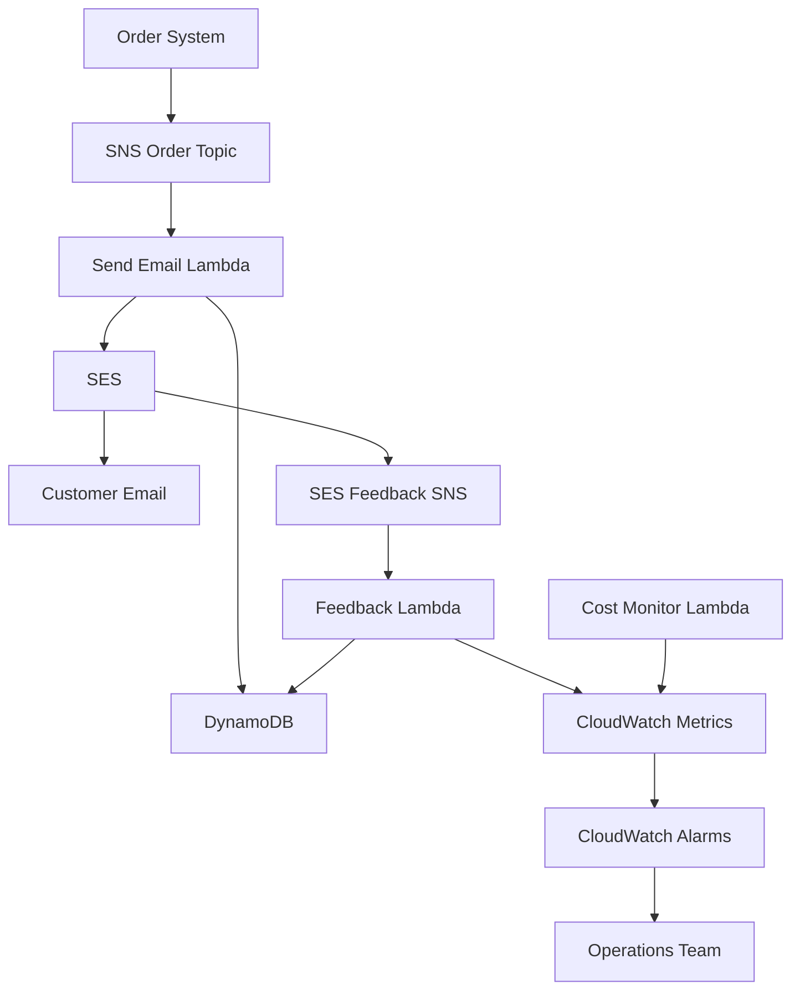

# Ideal Response - Email Notification System

## Overview

This document outlines the ideal implementation for an email notification system using AWS services including SNS, SES, Lambda, DynamoDB, and CloudWatch. The system handles ~2,000 order confirmation emails per day with proper tracking, cost monitoring, and operational visibility.

## Architecture

## Key Features

### 1. Email Processing Pipeline

- **SNS Topic**: `order-confirmations` receives order events
- **Lambda Function**: `send-order-email` processes and validates orders
- **SES Integration**: Sends transactional emails with tracking
- **Idempotency**: Prevents duplicate emails using DynamoDB conditional writes

### 2. Delivery Tracking

- **DynamoDB Table**: `email-deliveries` stores message lifecycle
- **Status Tracking**: SENT → DELIVERED/BOUNCED/COMPLAINT
- **Query Patterns**: By orderId, email address, or status
- **TTL Support**: Automatic cleanup of old records

### 3. Feedback Processing

- **SES Event Publishing**: Delivery, bounce, and complaint events to SNS
- **Feedback Lambda**: Updates delivery status in DynamoDB
- **Metrics**: Real-time bounce/complaint rates in CloudWatch

### 4. Cost Monitoring

- **Lambda Function**: `cost-monitoring` analyzes usage patterns
- **CloudWatch Integration**: Custom metrics for cost analysis
- **Alerting**: Notifications when thresholds are exceeded
- **Resource Optimization**: Recommendations based on usage patterns

### 5. Operational Excellence

- **CloudWatch Dashboards**: Real-time visibility into system health
- **Alarms**: Proactive alerting for bounce rates, failures, costs
- **Logging**: Structured logging for troubleshooting
- **Monitoring**: End-to-end observability

## Implementation Requirements

### Security

- ✅ IAM roles with least-privilege access
- ✅ Encryption at rest (DynamoDB, SNS with KMS)
- ✅ SES domain verification and DKIM
- ✅ VPC endpoints for private communication (optional)

### Scalability

- ✅ Pay-per-request billing for DynamoDB
- ✅ Auto-scaling Lambda concurrency
- ✅ SNS fan-out for multiple subscribers
- ✅ SES sending quotas management

### Cost Optimization

- ✅ On-demand DynamoDB billing
- ✅ Lambda cost monitoring and alerting
- ✅ SES transactional email pricing
- ✅ CloudWatch log retention policies

### Cross-Account Compatibility

- ✅ No hardcoded account IDs or ARNs
- ✅ Parameter-driven configuration
- ✅ Environment-specific resource naming
- ✅ Region-agnostic deployment

### Testing Strategy

- ✅ Unit tests for all Lambda functions
- ✅ Integration tests for email flow
- ✅ Load testing for 2k+ emails/day
- ✅ Chaos testing for failure scenarios

## Resource Tagging

All resources are tagged with:

- `iac-rlhf-amazon`: Standard project tag
- `Environment`: dev/test/prod
- `Service`: email-notifications
- `CostCenter`: operations
- `Owner`: platform-team

## Success Metrics

### Functional

- Email delivery rate > 99%
- Processing latency < 5 seconds
- Zero duplicate emails
- 100% delivery status tracking

### Operational

- System availability > 99.9%
- Mean time to recovery < 15 minutes
- Alert response time < 5 minutes
- Cost predictability within 10%

### Performance

- Support for burst traffic (10x normal load)
- Auto-scaling response time < 30 seconds
- Database query performance < 100ms
- End-to-end processing < 10 seconds

This architecture provides a robust, scalable, and cost-effective email notification system suitable for production workloads with comprehensive monitoring and operational excellence.
