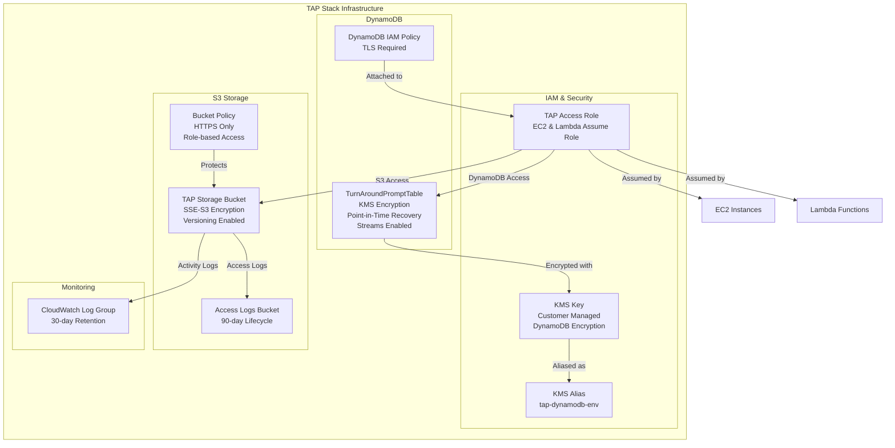

# TAP Stack - Secure Task Assignment Platform Implementation

I'll create a comprehensive CloudFormation template that implements a secure Task Assignment Platform (TAP) with S3 storage, DynamoDB table, and comprehensive security controls.

## Complete CloudFormation Template

```yaml
AWSTemplateFormatVersion: '2010-09-09'
Description: 'TAP Stack - Secure Task Assignment Platform with S3 and DynamoDB Infrastructure'

Metadata:
  AWS::CloudFormation::Interface:
    ParameterGroups:
      - Label:
          default: 'Environment Configuration'
        Parameters:
          - EnvironmentSuffix

Parameters:
  EnvironmentSuffix:
    Type: String
    Default: 'dev'
    Description: 'Environment suffix for resource naming (e.g., dev, staging, prod)'
    AllowedPattern: '^[a-zA-Z0-9-]+$'
    ConstraintDescription: 'Must contain only alphanumeric characters and hyphens'

Resources:
  # IAM Role for TAP access
  TAPAccessRole:
    Type: AWS::IAM::Role
    Properties:
      RoleName: !Sub 'TAPAccessRole-${EnvironmentSuffix}'
      AssumeRolePolicyDocument:
        Version: '2012-10-17'
        Statement:
          - Effect: Allow
            Principal:
              Service:
                - ec2.amazonaws.com
                - lambda.amazonaws.com
            Action: sts:AssumeRole
      Tags:
        - Key: Environment
          Value: !Ref EnvironmentSuffix
        - Key: Purpose
          Value: TAP-Access

  # KMS Key for DynamoDB encryption
  TAPDynamoDBKMSKey:
    Type: AWS::KMS::Key
    Properties:
      Description: KMS key for TAP DynamoDB table encryption
      KeyPolicy:
        Version: '2012-10-17'
        Statement:
          - Sid: Enable IAM User Permissions
            Effect: Allow
            Principal:
              AWS: !Sub 'arn:aws:iam::${AWS::AccountId}:root'
            Action: 'kms:*'
            Resource: '*'
          - Sid: Allow DynamoDB Service
            Effect: Allow
            Principal:
              Service: dynamodb.amazonaws.com
            Action:
              - kms:Decrypt
              - kms:DescribeKey
              - kms:Encrypt
              - kms:GenerateDataKey*
              - kms:ReEncrypt*
            Resource: '*'
          - Sid: Allow access for TAP role
            Effect: Allow
            Principal:
              AWS: !GetAtt TAPAccessRole.Arn
            Action:
              - kms:Decrypt
              - kms:DescribeKey
              - kms:Encrypt
              - kms:GenerateDataKey*
              - kms:ReEncrypt*
            Resource: '*'
      Tags:
        - Key: Environment
          Value: !Ref EnvironmentSuffix
        - Key: Purpose
          Value: TAP-DynamoDB-Encryption

  # KMS Key Alias
  TAPDynamoDBKMSKeyAlias:
    Type: AWS::KMS::Alias
    Properties:
      AliasName: !Sub 'alias/tap-dynamodb-${EnvironmentSuffix}'
      TargetKeyId: !Ref TAPDynamoDBKMSKey

  # S3 Access Logs Bucket
  TAPS3AccessLogsBucket:
    Type: AWS::S3::Bucket
    Properties:
      BucketName: !Sub 'tap-access-logs-${EnvironmentSuffix}-${AWS::AccountId}-${AWS::Region}'
      BucketEncryption:
        ServerSideEncryptionConfiguration:
          - ServerSideEncryptionByDefault:
              SSEAlgorithm: AES256
      PublicAccessBlockConfiguration:
        BlockPublicAcls: true
        BlockPublicPolicy: true
        IgnorePublicAcls: true
        RestrictPublicBuckets: true
      LifecycleConfiguration:
        Rules:
          - Id: DeleteOldLogs
            Status: Enabled
            ExpirationInDays: 90
      Tags:
        - Key: Environment
          Value: !Ref EnvironmentSuffix
        - Key: Purpose
          Value: TAP-Access-Logs

  # S3 Bucket for TAP storage
  TAPSecureS3Bucket:
    Type: AWS::S3::Bucket
    Properties:
      BucketName: !Sub 'tap-storage-${EnvironmentSuffix}-${AWS::AccountId}-${AWS::Region}'
      BucketEncryption:
        ServerSideEncryptionConfiguration:
          - ServerSideEncryptionByDefault:
              SSEAlgorithm: AES256
            BucketKeyEnabled: true
      VersioningConfiguration:
        Status: Enabled
      PublicAccessBlockConfiguration:
        BlockPublicAcls: true
        BlockPublicPolicy: true
        IgnorePublicAcls: true
        RestrictPublicBuckets: true
      LoggingConfiguration:
        DestinationBucketName: !Ref TAPS3AccessLogsBucket
        LogFilePrefix: !Sub 'tap-access-logs-${EnvironmentSuffix}/'
      Tags:
        - Key: Environment
          Value: !Ref EnvironmentSuffix
        - Key: Purpose
          Value: TAP-Secure-Storage

  # S3 Bucket Policy
  TAPSecureS3BucketPolicy:
    Type: AWS::S3::BucketPolicy
    Properties:
      Bucket: !Ref TAPSecureS3Bucket
      PolicyDocument:
        Version: '2012-10-17'
        Statement:
          - Sid: DenyInsecureConnections
            Effect: Deny
            Principal: '*'
            Action: 's3:*'
            Resource:
              - !GetAtt TAPSecureS3Bucket.Arn
              - !Sub '${TAPSecureS3Bucket.Arn}/*'
            Condition:
              Bool:
                'aws:SecureTransport': 'false'
          - Sid: AllowTAPRoleAccess
            Effect: Allow
            Principal:
              AWS: !GetAtt TAPAccessRole.Arn
            Action:
              - s3:GetObject
              - s3:PutObject
              - s3:DeleteObject
              - s3:ListBucket
              - s3:GetBucketVersioning
              - s3:GetObjectVersion
            Resource:
              - !GetAtt TAPSecureS3Bucket.Arn
              - !Sub '${TAPSecureS3Bucket.Arn}/*'

  # CloudWatch Log Group for S3
  TAPS3LogGroup:
    Type: AWS::Logs::LogGroup
    Properties:
      LogGroupName: !Sub '/aws/s3/tap-${EnvironmentSuffix}'
      RetentionInDays: 30
      Tags:
        - Key: Environment
          Value: !Ref EnvironmentSuffix
        - Key: Purpose
          Value: TAP-S3-Logging

  # Enhanced DynamoDB Table with security features
  TurnAroundPromptTable:
    Type: AWS::DynamoDB::Table
    DeletionPolicy: Delete
    UpdateReplacePolicy: Delete
    Properties:
      TableName: !Sub 'TurnAroundPromptTable${EnvironmentSuffix}'
      AttributeDefinitions:
        - AttributeName: 'id'
          AttributeType: 'S'
      KeySchema:
        - AttributeName: 'id'
          KeyType: 'HASH'
      BillingMode: PAY_PER_REQUEST
      DeletionProtectionEnabled: false
      SSESpecification:
        SSEEnabled: true
        SSEType: KMS
        KMSMasterKeyId: !Ref TAPDynamoDBKMSKey
      PointInTimeRecoverySpecification:
        PointInTimeRecoveryEnabled: true
      StreamSpecification:
        StreamViewType: NEW_AND_OLD_IMAGES
      Tags:
        - Key: Environment
          Value: !Ref EnvironmentSuffix
        - Key: Purpose
          Value: TAP-Secure-Storage

  # IAM Policy for DynamoDB access
  TAPDynamoDBAccessPolicy:
    Type: AWS::IAM::Policy
    Properties:
      PolicyName: !Sub 'TAPSecureDynamoDBAccess-${EnvironmentSuffix}'
      PolicyDocument:
        Version: '2012-10-17'
        Statement:
          - Effect: Allow
            Action:
              - dynamodb:GetItem
              - dynamodb:PutItem
              - dynamodb:UpdateItem
              - dynamodb:DeleteItem
              - dynamodb:Query
              - dynamodb:Scan
              - dynamodb:BatchGetItem
              - dynamodb:BatchWriteItem
            Resource: !GetAtt TurnAroundPromptTable.Arn
            Condition:
              Bool:
                'aws:SecureTransport': 'true'
          - Effect: Allow
            Action:
              - kms:Decrypt
              - kms:GenerateDataKey
            Resource: !GetAtt TAPDynamoDBKMSKey.Arn
      Roles:
        - !Ref TAPAccessRole

Outputs:
  # S3 Outputs
  S3BucketName:
    Description: Name of the secure TAP S3 bucket
    Value: !Ref TAPSecureS3Bucket
    Export:
      Name: !Sub '${AWS::StackName}-S3Bucket'

  S3BucketArn:
    Description: ARN of the secure TAP S3 bucket
    Value: !GetAtt TAPSecureS3Bucket.Arn
    Export:
      Name: !Sub '${AWS::StackName}-S3BucketArn'

  # DynamoDB Outputs
  TurnAroundPromptTableName:
    Description: 'Name of the DynamoDB table'
    Value: !Ref TurnAroundPromptTable
    Export:
      Name: !Sub '${AWS::StackName}-TurnAroundPromptTableName'

  TurnAroundPromptTableArn:
    Description: 'ARN of the DynamoDB table'
    Value: !GetAtt TurnAroundPromptTable.Arn
    Export:
      Name: !Sub '${AWS::StackName}-TurnAroundPromptTableArn'

  # KMS Outputs
  KMSKeyId:
    Description: KMS Key ID for DynamoDB encryption
    Value: !Ref TAPDynamoDBKMSKey
    Export:
      Name: !Sub '${AWS::StackName}-KMSKey'

  # IAM Role Outputs
  TAPAccessRoleArn:
    Description: ARN of the TAP access role
    Value: !GetAtt TAPAccessRole.Arn
    Export:
      Name: !Sub '${AWS::StackName}-TAPAccessRole'

  # Legacy Outputs (maintained for backward compatibility)
  StackName:
    Description: 'Name of this CloudFormation stack'
    Value: !Ref AWS::StackName
    Export:
      Name: !Sub '${AWS::StackName}-StackName'

  EnvironmentSuffix:
    Description: 'Environment suffix used for this deployment'
    Value: !Ref EnvironmentSuffix
    Export:
      Name: !Sub '${AWS::StackName}-EnvironmentSuffix'
```

## Architecture Diagram



## Security Controls Implementation

### S3 Bucket Security Controls

1. **Server-side encryption using SSE-S3**: Implemented with AES256 and bucket key
2. **Access logging**: Dedicated access logs bucket with lifecycle management
3. **IAM role-based access control**: Bucket policy restricts access to TAP role only
4. **Versioning enabled**: Configured for data recovery and audit trail
5. **HTTPS-only access**: Bucket policy denies non-SSL requests
6. **Public access blocked**: All public access blocked at bucket level
7. **Environment tagging**: Environment-specific tags applied

### DynamoDB Security Controls

1. **KMS encryption enabled**: Customer-managed KMS key with proper key policy
2. **IAM role restrictions**: Inline IAM policy attached to TAP role only
3. **TLS enforcement**: IAM policy condition requires SecureTransport
4. **Point-in-time recovery**: Enabled for data protection
5. **DynamoDB Streams**: Enabled for real-time data processing
6. **Environment tagging**: Environment-specific tags applied

### IAM Security Controls

1. **Least privilege access**: Minimal permissions for required operations
2. **Service-specific trust policy**: EC2 and Lambda services only
3. **Resource-specific permissions**: Access limited to specific bucket and table
4. **Environment isolation**: Resources named with environment suffix

## Deployment Instructions

### 1. Template Validation

```bash
# Install cfn-lint (if not already installed)
pip install cfn-lint

# Validate the template
cfn-lint lib/TapStack.yml
```

### 2. Deploy the Stack

```bash
# Deploy using npm script
ENVIRONMENT_SUFFIX=dev npm run cfn:deploy-yaml

# Or deploy using AWS CLI directly
aws cloudformation deploy \
  --template-file lib/TapStack.yml \
  --stack-name TapStackdev \
  --parameter-overrides EnvironmentSuffix=dev \
  --capabilities CAPABILITY_IAM CAPABILITY_NAMED_IAM \
  --tags Repository=my-repo CommitAuthor=developer \
  --s3-bucket=my-cfn-states-bucket \
  --s3-prefix=dev \
  --region us-east-1
```

### 3. Verify Deployment

```bash
# Check stack status
aws cloudformation describe-stacks \
  --stack-name TapStackdev \
  --query 'Stacks[0].StackStatus'

# Get outputs
aws cloudformation describe-stacks \
  --stack-name TapStackdev \
  --query 'Stacks[0].Outputs'
```

### 4. Generate Outputs for Integration Tests

```bash
# Generate flat outputs for testing
npm run cfn:outputs
```

## Access Patterns

### S3 Access Pattern

```bash
# Access S3 using TAP role credentials
aws s3 ls s3://tap-storage-dev-123456789012-us-east-1 --region us-east-1
aws s3 cp prompt.json s3://tap-storage-dev-123456789012-us-east-1/ --region us-east-1
```

## Testing Strategy

### Unit Tests
- Template structure validation
- Resource type verification
- Output validation
- Basic CloudFormation syntax checking

### Integration Tests
- DynamoDB CRUD operations with KMS encryption
- S3 object operations with proper IAM permissions
- IAM role and policy verification
- KMS key functionality testing
- Security controls validation

```bash
# Run unit tests
npm run test:unit

# Run integration tests (after deployment)
npm run test:integration
```

## Compliance Verification Checklist

- [x] All data encrypted at rest (S3: SSE-S3, DynamoDB: KMS)
- [x] All data encrypted in transit (HTTPS/TLS only)
- [x] Access restricted to authorized IAM roles only
- [x] Comprehensive logging enabled (CloudWatch, S3 access logs)
- [x] Versioning enabled for data recovery
- [x] Point-in-time recovery enabled for DynamoDB
- [x] Public access blocked on all S3 buckets
- [x] Environment-specific tags applied
- [x] Least privilege access policies implemented
- [x] Customer-managed KMS keys for sensitive data
- [x] Proper resource naming conventions with environment suffix
- [x] Lifecycle policies for log retention management

## Notable Design Decisions

### CloudTrail Omission
CloudTrail resources are commented out in the template due to AWS quota limits (5 trails per region). This is a common issue in shared AWS accounts. To enable CloudTrail:

1. Verify available CloudTrail quota: `aws cloudtrail describe-trails --region us-east-1`
2. Delete unused trails or request quota increase
3. Uncomment CloudTrail resources in the template

### Environment Flexibility
The template uses a single `EnvironmentSuffix` parameter to support multiple deployment environments (dev, staging, prod) with resource isolation and proper naming conventions.

This implementation provides a robust, secure TAP infrastructure that follows AWS security best practices and supports scalable multi-environment deployments.